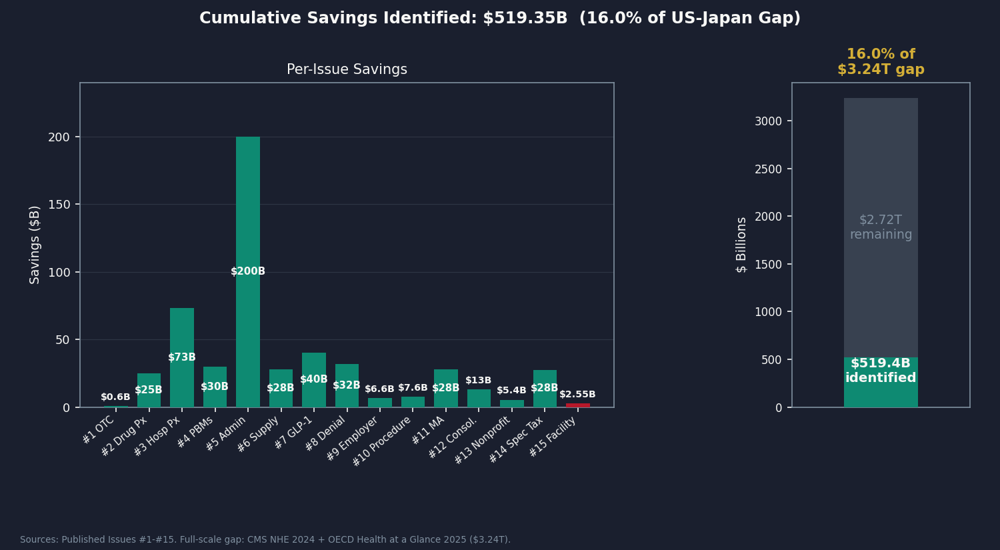
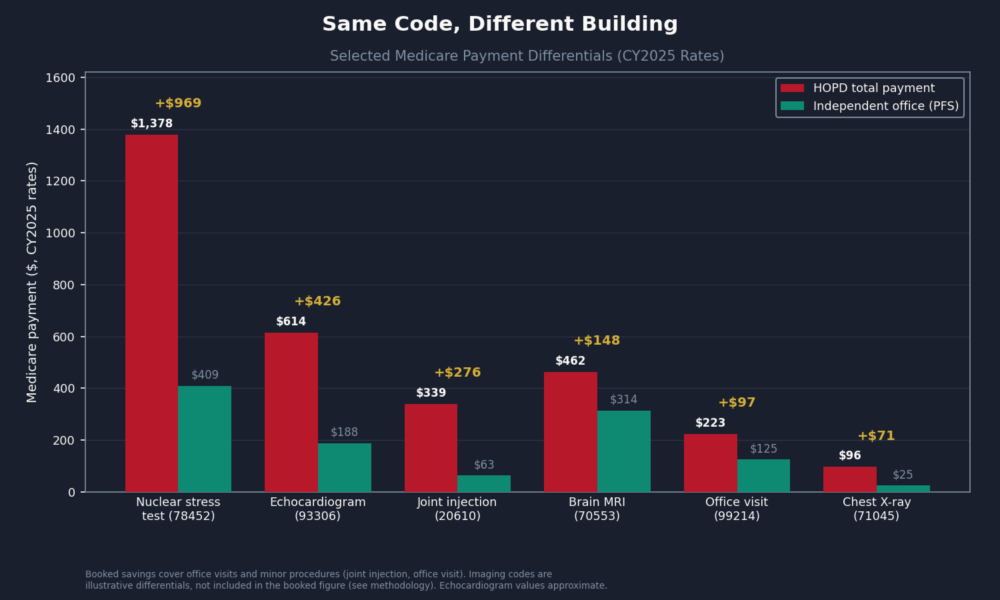
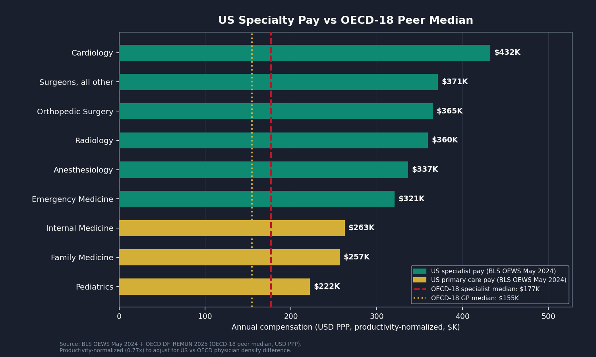
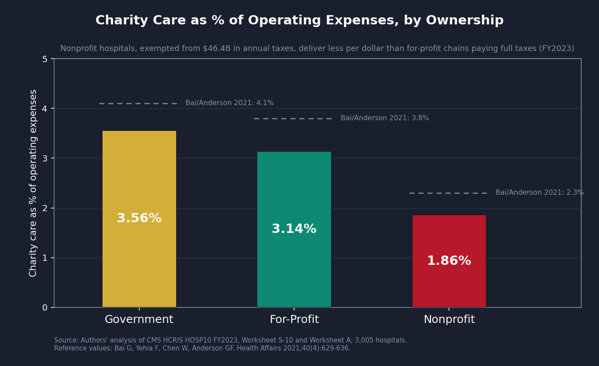
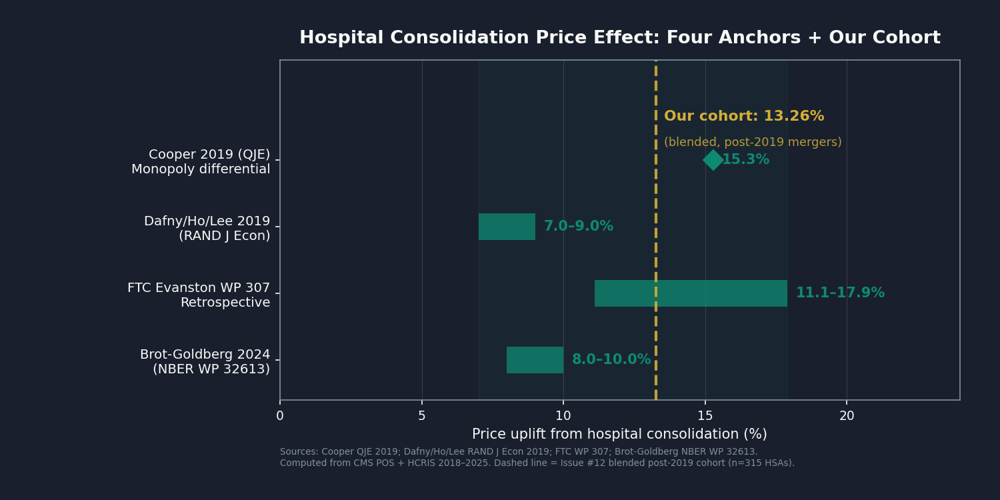
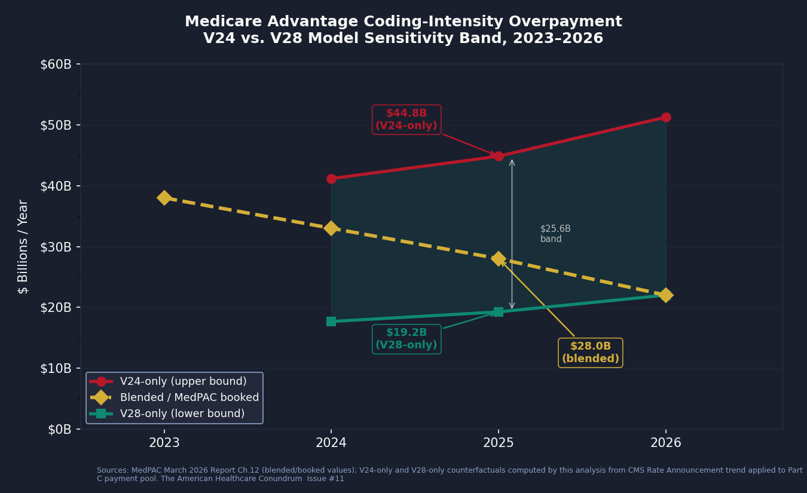
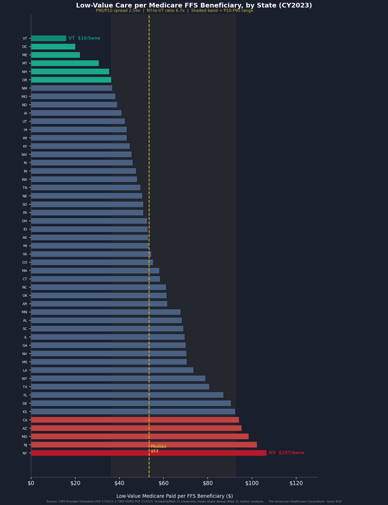
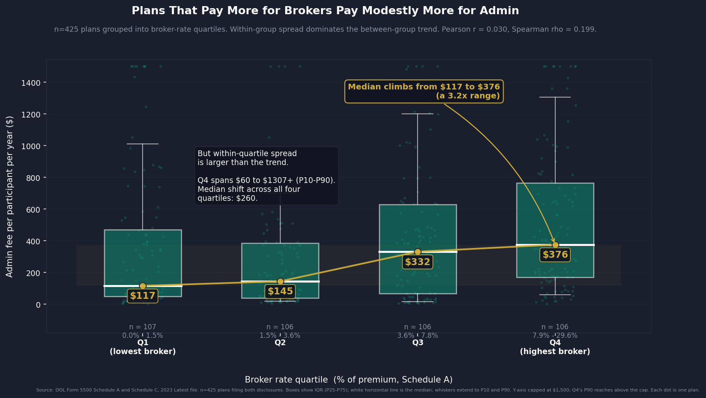
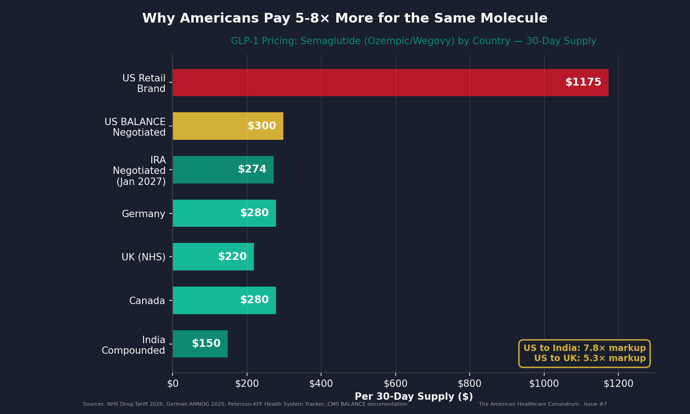
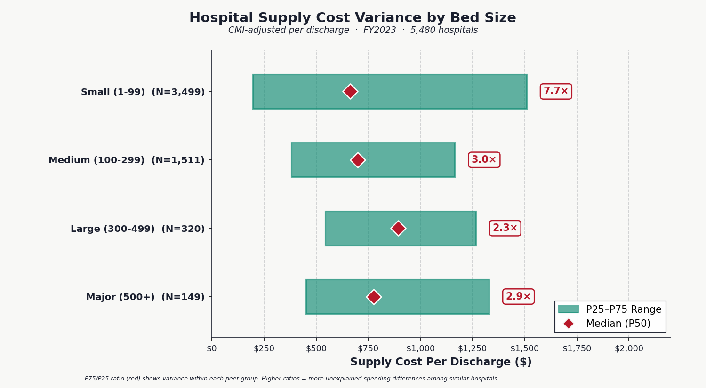

# The American Healthcare Conundrum

The US spends ~$15,474 per person on healthcare. Japan spends ~$5,790 and has the highest life expectancy in the OECD. That gap is roughly **$3.24 trillion per year.**

This project finds it, one issue at a time. Each issue identifies one fixable problem, quantifies the waste from primary federal data, and recommends a specific policy fix. All code is open-source. Anyone can reproduce the analysis.

**[Read the newsletter](https://americanhealthcareconundrum.com)** | **[MIT License](LICENSE)** | **[Contributing](CONTRIBUTING.md)**

---

> **Latest Issue (#15): [The Facility Fee Scam](issue_15/newsletter_issue_15.md)** — When a hospital system buys a physician practice and converts it to provider-based status, the same office visit in the same building starts generating two Medicare claims instead of one: the physician's professional fee plus a hospital facility fee that flows to the hospital. A chest X-ray Medicare pays $25.23 for at an independent office costs $96.46 at a hospital-owned clinic, 3.8 times more for an identical study. Applying CY2025 CMS rates to 2023 utilization across the two categories public data can cleanly isolate (clinic visits and minor procedures), the computation produces $1.967B/year in Medicare counterfactual savings. Extended conservatively to commercial insurance (1.5x Medicare) and netted against overlap with Issues #3 and #12 at 60% recoverability, we book **$2.55B/year** (range $0.93B to $4.13B). Diagnostic imaging and drug administration, both larger and both on MedPAC's site-neutral list, are excluded because public files cannot isolate hospital-outpatient volume from inpatient, ER, and ASC settings; they are the explicit data-partner ask. The fix is site-neutral payment, which MedPAC has recommended every year since 2014 and Congress has passed only in part. [Read it →](https://americanhealthcareconundrum.com/issue-15-the-facility-fee-scam)

---

## Savings Identified So Far

| # | Issue | Savings | Key Finding | Data Source |
|---|-------|---------|-------------|-------------|
| 1 | [OTC Drug Overspending](issue_01/newsletter_issue_01_FINAL.md) | $0.6B/yr | Medicare pays Rx prices for drugs you can buy off the shelf | CMS Part D 2023 |
| 2 | [The Same Pill, A Different Price](issue_02/newsletter_issue_02_FINAL.md) | $25.0B/yr | US pays 7–581x more than peer nations for the same drugs | CMS Part D, NHS Tariff, RAND |
| 3 | [The 254% Problem](issue_03/newsletter_issue_03.md) | $73.0B/yr | Commercial insurers pay 254% of Medicare for identical hospital procedures | CMS HCRIS, RAND 5.1 |
| 4 | [The Middlemen](issue_04/newsletter_issue_04.md) | $30.0B/yr | Three PBMs process 80% of US prescriptions and extract ~$30B/yr through spread pricing, rebate opacity, and formulary manipulation | FTC Interim Reports, Ohio Auditor, JAMA |
| 5 | [The Paper Chase](issue_05/newsletter_issue_05.md) | $200.0B/yr | US spends $4,983/person on healthcare admin vs. $884 in peer nations; original HCRIS analysis of 4,518 hospitals reveals 6.2× variance in overhead costs | CMS HCRIS, CMS NHE, OECD, AMA |
| 6 | [The Supply Closet](issue_06/newsletter_issue_06.md) | $28.0B/yr | Original HCRIS analysis of 5,480 hospitals reveals massive variance in per-discharge supply costs; CMI-adjusted P75/P25 ratios of 2.5–3.4× within same-size peer groups | CMS HCRIS FY2023 |
| 7 | [The GLP-1 Gold Rush](issue_07/newsletter_issue_07.md) | $40.0B/yr | US GLP-1 spending grew 1,200-fold in 5 years ($57M→$71.7B); US pays 3–5× international prices; original 10-year BALANCE budget projection for Medicare GLP-1 coverage | CMS Part D, OECD, KFF, CBO |
| 8 | [The Denial Machine](issue_08/newsletter_issue_08.md) | $32.0B/yr | Original CMS-0057-F extraction of 93 MA contracts (UHC denial rate 13.5%, appeal overturn 58–65%, ~3M denied entitled care annually); care suppression, vertical integration arbitrage, and AI-driven denial escalation | CMS-0057-F, UNH/HUM 10-K, Health Affairs, Stanford npj |
| 9 | [The Employer Trap](issue_09/newsletter_issue_09.md) | $6.6B/yr | First plan-level analysis of post-CAA 2021 broker and admin-fee disclosures (8,180 health welfare plans, 23.8M participants); per-plan broker commissions above 3% DOL benchmark and admin fees above peer-group medians | DOL Form 5500 Schedule A and Schedule C 2023, KFF EHBS 2024, JAMA Network Open |
| 10 | [The Procedure Mill](issue_10/newsletter_issue_10.md) | $7.6B/yr | Full CY2023 CMS PUF analysis (268,634 rows) of the 31-service Schwartz/Mafi/Choosing Wisely list; state-level P90/P10 spread of 6.7x in low-value Medicare spending per beneficiary, with an all-payer extension and a defensive-medicine difference-in-differences slice | CMS Provider Utilization, Hospital Outpatient, and Geographic Variation PUFs CY2023; Schwartz et al. 2014; Kim & Fendrick JAMA Health Forum 2025; Avraham DSTLR 7.1 |
| 11 | [The MA Overpayment](issue_11/newsletter_issue_11.md) | $28.0B/yr | $76B total MA-FFS payment gap (MedPAC March 2026); coding-intensity slice booked at $28B for 2025 with V24 vs. V28 sensitivity band of $19.2B–$44.8B computed from CMS Geographic Variation PUFs; HRA decomposition and state-level allocation original; cross-validated against Kronick et al. 2025 ($33B for 2021) and OIG HRA audits | MedPAC March 2026; Kronick et al. *Annals of Internal Medicine* 2025; CMS Geographic Variation PUFs (MA + FFS); HHS-OIG HRA audits 2020 and 2024; CMS HCC risk-adjustment model files; DOJ FCA settlement track |
| 12 | [The Consolidation Tax](issue_12/newsletter_issue_12.md) | $13.0B/yr | Panel of 1,155 ownership-change events across 2018–2025 from CMS POS, narrowed to 530 horizontal hospital mergers in 315 unique HSAs with mean HHI shift of 2,318 points; piecewise HHI-dependent coefficient (Cooper / Dafny / FTC Evanston / Brot-Goldberg anchors) applied per market, net of $3.47B Issue #3 hospital-pricing overlap and $0.87B Issue #15 vertical-integration overlap | CMS POS annual snapshots 2018–2025; CMS HCRIS FY2018–FY2023; Dartmouth ZIP-HSA-HRR crosswalk; Cooper QJE 2019; Dafny RAND J Econ 2019; FTC Working Paper 307; Brot-Goldberg et al. NBER WP 32613 (Feb 2026 rev); Fulton et al. Health Affairs 2022 |
| 13 | [The Nonprofit Lie](issue_13/newsletter_issue_13.md) | $5.4B/yr | Panel of 3,005 nonprofit hospitals from CMS HCRIS FY2023 joined to per-filer Form 990 Schedule H pulled directly from IRS bulk XML (2,103 filers, 76% of panel expenses); 86% of nonprofit hospitals deliver less audited charity care than the value of their tax exemption (narrow Herring 2018 test); aggregate tax exemption $46.4B vs. audited charity care $17.2B; booked figure net of overlap with Issues #3 and #12 at 53% recoverability | CMS HCRIS FY2023 (Worksheet S-10, charity at cost); IRS Form 990 Schedule H 2023 (per-filer XML); Plummer, Socal, Bai *JAMA* 2024 (tax-exemption valuation method); Bai/Yehia/Chen/Anderson *Health Affairs* 2021 (broad-subset community benefit); Herring et al. *Health Affairs* 2018 (narrow-test benchmark); HHS OIG Schedule H studies |
| 14 | [The Specialist Tax](issue_14/newsletter_issue_14.md) | $27.6B/yr | US specialist pay is set by an administered RVU cascade (RUC → CMS → commercial multiples), not a free market; productivity-normalized gap to an 18-country high-income OECD peer set, plus workforce-mix, RVU-misvaluation, and GME-allocation components | CMS PFS RVU File CY2025, Medicare PUF 2024, BLS OEWS May 2024, OECD Health at a Glance 2025 |
| 15 | [The Facility Fee Scam](issue_15/newsletter_issue_15.md) | $2.55B/yr | Hospital-owned clinics bill Medicare 2–4x the office rate for the same procedure once converted to provider-based status; CY2025 site-of-service differential on 2023 utilization for clinic visits and minor procedures ($1.967B Medicare base), extended to commercial and netted for overlap; imaging and drug administration excluded as the data-partner ask | CMS OPPS Addendum B CY2025, CMS PFS RVU25D CY2025, Medicare Physician PUF DY2023, MedPAC |
| | **Running Total** | **$519.35B/yr** | **16.0% of the $3.24T gap** | |

*Issue #9 is the first issue at the revised $3.24T denominator (CMS NHE 2024 final, released April 18, 2026). Issues #1–#8 published using the prior $3T denominator and are not retrofitted.*



---

## The Core Finding

The same operations. Exposed to the same clinical evidence. Wildly different prices.


*Source: iFHP International Health Cost Comparison 2024–2025. Prices are median insurer-paid amounts.*

---

## Published Issues

### Issue #15 — The Facility Fee Scam (~$2.55B/year)

When a hospital system acquires a physician practice and converts it to provider-based status (42 C.F.R. Section 413.65), the same service in the same building stops billing under the Physician Fee Schedule (PFS) and starts billing under the Outpatient Prospective Payment System (OPPS): one professional claim plus a separate hospital facility fee. Medicare pays two to four times the office rate for clinically identical work. A chest X-ray Medicare reimburses at $25.23 in an independent office is reimbursed at $96.46 at a hospital-owned clinic. Using CMS OPPS Addendum B CY2025 facility rates, the CMS PFS RVU25D CY2025 office rates, and Medicare Physician PUF DY2023 volume, the analysis computes a per-procedure site-of-service differential for the two categories public data can cleanly isolate: clinic visits (9 codes, 18.5M HOPD visits/year, $1.821B) and minor procedures (6 codes, 0.5M services/year, $0.146B), a $1.967B Medicare counterfactual base. Extended to commercial insurance at a conservative 1.5x Medicare multiplier, netted against Issue #3 (15% of the commercial layer) and Issue #12 (5% of gross) overlap, and discounted to 60% recoverability for legislative grandfathering friction, we book **$2.55 billion per year** (range $0.93B to $4.13B). Diagnostic imaging (358 codes, gross $4.68B) and drug administration are excluded because the public Physician PUF facility flag cannot separate hospital-outpatient volume from inpatient, emergency-department, and ambulatory-surgery-center settings; both are the explicit data-partner ask. The fix is site-neutral payment, recommended by MedPAC every year since 2014 and enacted only partially by Section 603 of the Bipartisan Budget Act of 2015.



*Source: CMS OPPS Addendum B CY2025, CMS PFS RVU25D CY2025, Medicare Physician and Other Practitioners by Geography and Service DY2023.*

**Read the full analysis →** [`issue_15/newsletter_issue_15.md`](issue_15/newsletter_issue_15.md)

<details>
<summary>Reproducing the analysis</summary>

```bash
cd issue_15

# Download CMS OPPS Addendum B, PFS RVU25D, and Medicare Physician PUF;
# join by HCPCS; compute per-procedure site-of-service differential for the
# two clean categories; build commercial extension, overlap subtractions,
# and recoverability sensitivity
python 01_build_data.py

# Generate all five charts plus hero
python generate_all_charts.py
```

**Key outputs:**
- `results/savings_estimate.json` — Booked $2.55B, range $0.93–$4.13B, components, overlap subtractions, recoverability
- `results/medicare_counterfactual_savings.csv` — Per-category Medicare counterfactual savings
- `results/per_hcpcs_savings.csv` — Per-HCPCS site-of-service differential
- `results/savings_by_component.csv` — Component build (Medicare base, commercial extension, overlaps, recoverability)
- `results/commercial_extrapolation.csv` — Commercial extension at 1.5x (range to 2.54x RAND ratio)
- `results/cross_validation.csv` — Against MedPAC ambulatory aggregate and CBO clinic-visit scoring
- `results/methodology.md` — Full methodology, exclusion rationale for imaging and drug administration
- `results/originality_gate.md` — Stage 3.5 originality-gate verdict and adversarial-math notes

</details>

<details>
<summary>Data sources</summary>

| Source | Description |
|--------|-------------|
| CMS OPPS Addendum B CY2025 | Hospital Outpatient Prospective Payment System facility rates by HCPCS |
| CMS PFS Relative Value File RVU25D CY2025 | Physician Fee Schedule non-facility (office) allowed amounts by HCPCS |
| CMS Medicare Physician and Other Practitioners by Geography and Service DY2023 | Service volume by HCPCS and place of service |
| MedPAC March 2014, March 2023, March 2025 Reports | Site-neutral payment recommendations and ambulatory aggregate |
| Capps, Dranove, Ody, J Health Econ 59:139–152 (2018) | Hospital-acquired physician prices rose 14.1%, ~half from site-of-service shift |
| Bipartisan Budget Act of 2015 Section 603; 42 C.F.R. 413.65 | Provider-based status and partial site-neutral fix |
| Health Affairs 45(2):218–225 (2026) | Optum ASC acquisitions associated with 11% commercial price increase |

</details>

<details>
<summary>Key methodology notes</summary>

- Two booked Medicare categories computed per HCPCS: clinic visits ($1.821B) and minor procedures ($0.146B), a $1.967B base. Rates are CY2025; volume is DY2023 (a 2025-rate counterfactual on 2023 use)
- Commercial extension at a conservative 1.5x Medicare (full RAND 5.1 ratio of 2.54x forms the range ceiling), not the inpatient-weighted hospital-wide average
- Overlap subtractions: Issue #3 (15% of the commercial layer, hospital-pricing transmission), Issue #12 (5% of gross, consolidation premium). Issue #14 distinct mechanism (0%)
- Recoverability factor 0.60 central (range 0.50–0.70) for legislative grandfathering delays
- Booked $2.55B; range $0.93–$4.13B
- Imaging (358 codes, gross $4.68B) and drug administration excluded: the Physician PUF facility flag cannot isolate HOPD-outpatient volume from inpatient, ER, ASC, and SNF settings, and drug-administration HOPD volume is packaged into Comprehensive APCs. Both require claims-level data (CMS LDS/VRDC, state APCD, MarketScan) and form the data-partner ask
- Cross-validation: MedPAC ambulatory aggregate (~$6.6B) includes imaging and drug administration; the booked base is a clean conservative subset; CBO clinic-visit scoring (~$3–7B over ten years) is consistent
- Editorial framing: the target is the provider-based billing architecture, not individual hospitals or physicians

</details>

---

### Issue #14 — The Specialist Tax (~$27.6B/year)

US physicians earn more than physicians in any other OECD country, but the gap between what the US pays specialists and what peer nations pay is not the product of a free labor market. It is the output of an administered price cascade. The American Medical Association's Specialty Society Relative Value Scale Update Committee (RUC) recommends the relative value units (RVUs) that determine physician payment; CMS adopted roughly 87% of RUC work-value recommendations unchanged between 1994 and 2010; commercial insurers benchmark their physician rates as multiples of Medicare (roughly 2.8–3.5× for procedural codes versus 1.4× for evaluation-and-management codes); and employers pay premiums that reflect those commercial rates. Procedural specialties are systematically overvalued relative to primary care and international peers. We computed the booked figure from four components: a productivity-normalized international compensation gap against an 18-country high-income OECD peer set ($64.2B raw, $35.3B recoverable), a workforce-mix counterfactual toward the COGME 45% primary-care target ($4.7B raw, $2.6B recoverable), an RVU-misvaluation residual that flows through the commercial cascade ($2.9B raw, $2.3B recoverable; Medicare itself nets $0 by statutory budget neutrality), and a GME-allocation counterfactual ($2.4B raw, $1.4B recoverable). Pre-overlap recoverable sum: $41.6B. After overlap subtractions against Issues #3 (hospital labor flow-through, $6.2B), #10 (physician-labor share of low-value volume, $1.5B), #11 (MA coding-intensity physician-billing share, $2.1B), and #12 (consolidation employed-specialist flow-through, $4.2B), we book **$27.6B/year** (range $19.7B–$35.5B). The savings show up in the commercial market, not inside Medicare. The fix targets the payment architecture, never any individual physician's income.



*Source: CMS PFS Relative Value File CY2025, Medicare Physician and Other Practitioners PUF 2024, BLS OEWS May 2024, OECD Health at a Glance 2025 Indicator 8.6, restricted to 18 high-income OECD peer countries.*

**Read the full analysis →** [`issue_14/newsletter_issue_14.md`](issue_14/newsletter_issue_14.md)

<details>
<summary>Reproducing the analysis</summary>

```bash
cd issue_14

# Build the four-component analysis: international compensation gap (OECD-18 peers),
# workforce-mix counterfactual, RVU-misvaluation residual, GME-allocation counterfactual,
# overlap subtractions, and recoverability sensitivity bands
python 01_build_data.py

# Generate all five charts plus hero
python generate_all_charts.py
```

**Key outputs:**
- `results/savings_estimate.json` — Booked $27.62B, range $19.65–35.49B, four components, overlap subtractions, recoverability bands
- `results/per_specialty_savings.csv` — Per-specialty international compensation gap
- `results/savings_by_component.csv` — Component A–D raw and recoverable totals
- `results/rvu_panel_full.csv` — RVU misvaluation residual by code family
- `results/international_compensation_panel.csv` — US (BLS anchor) vs. OECD-18 specialist and GP medians, PPP-USD
- `results/specialty_workforce_panel.csv` — BLS-FTE workforce mix vs. OECD median
- `results/overlap_subtractions.csv` — Overlap accounting against Issues #3, #10, #11, #12
- `results/recoverability_sensitivity.csv` — Conservative/central/aggressive recoverability bands
- `results/cross_validation.csv` — Against Laugesen/Glied 2011 and MedPAC
- `results/methodology.md` — Full methodology, editorial guardrail, and OECD-18 peer-set rationale
- `results/originality_gate.md` — Stage 3.5 originality-gate verdict and adversarial-math notes

</details>

<details>
<summary>Data sources</summary>

| Source | Description |
|--------|-------------|
| CMS Physician Fee Schedule Relative Value File CY2025 | RVU values by HCPCS code; basis for the RVU-misvaluation residual |
| CMS Medicare Physician and Other Practitioners by Geography and Service PUF, service year 2024 | Medicare-paid service volume by specialty and code |
| BLS Occupational Employment and Wage Statistics (OEWS) May 2024, 29-1xxx physician series | US physician FTE counts and wage anchors |
| OECD Health at a Glance 2025, Indicator 8.6 (Remuneration of Doctors), DF_REMUN dataset, PPP-USD | Country-by-country specialist and GP compensation for the 18-country high-income peer set |
| Laugesen MJ, Glied SA. Health Affairs 2011 | Cross-validation: US orthopedic surgeons ~2.2× peers on 2008 data (updated to 2.46×) |
| Laugesen, Wada, Chen. Health Affairs | CMS adoption of ~87% of RUC work-value recommendations 1994–2010 |
| MedPAC June 2025 Report; Bodenheimer, Berenson, Rudolf, Annals of Internal Medicine 2007 | E&M undervaluation / procedural overvaluation |
| GAO-15-434 (2015) | CMS lacks independent capacity to evaluate RUC recommendations at scale |
| AAMC March 2024 Physician Workforce Projections; COGME primary-care target | Workforce shortage projection and 45% primary-care target |

</details>

<details>
<summary>Key methodology notes</summary>

- Four components, each computed from public data: Component A (international compensation gap, productivity-normalized, OECD-18 high-income peers) $35.3B recoverable from $64.2B raw; Component B (workforce-mix counterfactual, BLS-FTE 28% PC share canonical, toward COGME 45%) $2.6B recoverable from $4.7B raw; Component C (RVU misvaluation residual, commercial cascade only; Medicare = $0 by statutory budget neutrality under SSA Sec. 1848(c)(2)(B)) $2.3B recoverable from $2.9B raw; Component D (GME allocation counterfactual) $1.4B recoverable from $2.4B raw
- Productivity normalization: raw compensation gap discounted by ~23% (2.7/3.5 = 0.77 physicians per 1,000) so each US physician's higher throughput is not counted as excess pay; this makes the estimate conservative
- OECD-18 peer set: AUS, AUT, BEL, CAN, CHE, DEU, DNK, FIN, FRA, GBR, IRL, ISL, ITA, NLD, NOR, NZL, SWE, KOR. Median computed as median-of-country-medians (one vote per country). Lower-income OECD members excluded as non-comparable
- US side anchored on BLS OEWS observed wages (the US does not submit to the OECD DF_REMUN dataset); Doximity/Medscape self-employed data run 10–25% higher, so Component A is conservative on the US side
- Pre-overlap recoverable sum $41.6B; overlap subtractions total $14.0B (Issue #3 $6.2B, Issue #10 $1.5B, Issue #11 $2.1B, Issue #12 $4.2B); booked $27.6B
- Range $19.7–35.5B from conservative and aggressive recoverability bands (each computed post-overlap)
- Editorial guardrail: the savings estimate is computed against system-level counterfactuals (different RVU schedule, different GME allocation, different workforce mix), never against any individual physician's compensation. The target is the payment system, not the people who chose medicine

</details>

---

### Issue #13 — The Nonprofit Lie (~$5.4B/year)

Sixty-seven percent of US hospitals operate as 501(c)(3) nonprofit, tax-exempt entities. In exchange for that exemption — no federal income tax, no state income tax, no property tax, no sales tax, and the ability to issue tax-exempt municipal bonds — the law requires a community-benefit obligation. We computed both sides of that exchange, hospital by hospital, for a panel of 3,005 nonprofit hospitals filing complete FY2023 Medicare cost reports. The aggregate value of the federal, state, and local tax exemption is $46.4 billion per year (federal income $17.0B; sales $11.4B; property $9.7B; state income $4.8B; tax-exempt bond subsidy $2.4B; charitable-deduction pass-through $1.0B; FUTA $0.1B), valued using the Plummer/Socal/Bai *JAMA* 2024 method. The audited charity care those hospitals deliver, from CMS HCRIS Worksheet S-10, is $17.2 billion per year. To close the data gap that has bounded prior nonprofit-hospital research, we pulled Form 990 Schedule H Part I directly from the IRS bulk XML for 2,103 filers (76 percent of panel expenses), with the remaining 24 percent falling back to HCRIS S-10 charity care uplifted to the Schedule H broad subset at the sector ratio. Under the narrow Herring 2018 test (audited charity care vs. tax-exemption value), 86 percent of the 3,005 hospitals fail, with an aggregate failing-hospital gap of $31.3 billion per year. Under the broad Bai 2021 Schedule H test (which adds Medicaid shortfall, community health, and subsidized services), 44 percent of hospitals fail with an aggregate gap of $11.9 billion. After deducting overlaps with Issues #3 (hospital pricing, $0.60B) and #12 (consolidation tax, $1.19B) and applying a 53 percent recoverability factor reflecting state revocation precedent (Provena, UPMC consent decree) and IRS enforcement realism, we book **$5.4 billion per year** (range $4.1B–$7.1B). The headline ownership comparison: government hospitals deliver 3.56 percent of operating expenses in charity care, for-profit hospitals 3.14 percent, and nonprofits 1.86 percent.



*Source: CMS HCRIS FY2023 Worksheet S-10, 3,005 nonprofit hospitals plus 1,576 for-profit and 911 government hospitals for comparison.*

**Read the full analysis →** [`issue_13/newsletter_issue_13.md`](issue_13/newsletter_issue_13.md)

<details>
<summary>Reproducing the analysis</summary>

```bash
cd issue_13

# Pull per-filer Form 990 Schedule H Part I from IRS bulk XML (2,103 filers)
python 02_schedule_h_pull.py
python 02b_run_batches.py

# Build the EIN to CCN crosswalk (joins IRS filers to CMS hospital identifiers)
python 03_build_crosswalk.py

# Main analysis: tax-exemption valuation, narrow + broad community-benefit tests,
# state-level decomposition, overlap subtractions, recoverability sensitivity
python 01_build_data.py

# Generate all five charts plus hero
python generate_all_charts.py
```

**Key outputs:**
- `results/savings_estimate.json` — Booked $5.38B, range $4.06–$7.11B, overlap subtractions, recoverability sensitivity
- `results/gap_panel.csv` — 3,005-hospital panel with narrow- and broad-test gaps
- `results/per_hospital_tax_exemption.csv` — Per-hospital tax-exemption valuation (7 components)
- `results/per_hospital_community_benefit.csv` — Per-hospital audited charity care plus Schedule H broad subset
- `results/per_filer_schedule_h.csv` — Per-filer Schedule H Part I pulled from IRS bulk XML (2,103 filers)
- `results/ein_ccn_crosswalk.csv` — IRS EIN to CMS CCN matched on filer name and state
- `results/savings_by_state.csv` — State-level decomposition of failing-hospital gap
- `results/overlap_subtractions.csv` — Overlap accounting against Issues #3 and #12
- `results/cross_validation.csv` — Cross-validation against Herring 2018, Bai 2021, Plummer 2024
- `results/methodology.md` — Full methodology including the v3 Schedule H pull patch and recoverability rationale
- `results/originality_gate.md` — Stage 3.5 originality-gate verdict and adversarial-math notes
- `results/schedule_h_pull_coverage.json` — Match coverage statistics for the IRS bulk pull

</details>

<details>
<summary>Data sources</summary>

| Source | Description |
|--------|-------------|
| CMS HCRIS HOSP10-REPORTS FY2023, Worksheet S-10 (charity at cost) and Worksheet A | Audited charity care and operating expenses for 3,005 nonprofit hospitals (plus for-profit and government for ownership comparison) |
| IRS Form 990 Schedule H Part I, FY2023 (bulk XML, IRS DOWNLOAD-990 archive) | Per-filer community-benefit reporting for 2,103 nonprofit hospital filers covering 76% of panel expenses |
| Plummer/Socal/Bai *JAMA* 2024 (DOI 10.1001/jama.2024.0349) | Tax-exemption valuation methodology (federal income, state income, property, sales, FUTA, charitable deduction pass-through, tax-exempt bond subsidy) |
| Bai/Yehia/Chen/Anderson *Health Affairs* 2021;40(4):629–636 (DOI 10.1377/hlthaff.2020.01627) | Broad-subset community-benefit test and ownership comparison framework |
| Herring/Gaskin/Zare/Anderson *Health Affairs* 2018;37(3):485–493 (DOI 10.1377/hlthaff.2017.1207) | Narrow-test benchmark (audited charity care vs. tax-exemption value) |
| HHS OIG Schedule H studies (2020, 2023) | Schedule H reliability and Medicaid shortfall composition |
| ProPublica Nonprofit Explorer NTEE-E top-10K filer universe | Filer universe for the EIN-CCN crosswalk |
| *Provena Covenant Medical Center v. IDOR*, 236 Ill. 2d 368 (2010); *Pennsylvania OAG v. UPMC* consent decree (2019) | State revocation precedent for the 53% recoverability factor |

</details>

<details>
<summary>Key methodology notes</summary>

- 3,005-hospital FY2023 panel after removing partial-year filings and extreme outliers (operating-expense range filters)
- Tax-exemption valuation follows the seven-component Plummer/Socal/Bai *JAMA* 2024 method applied to each hospital's federal Form 990 + CMS HCRIS financial line items; aggregate $46.4B; federal income tax forgone is the largest component at $17.0B (36.6%)
- Schedule H pull (v3 patch, May 2026): per-filer Schedule H Part I from IRS bulk XML for 2,103 matched filers (76% of panel expenses); the remaining 24% (975 hospitals) fall back to HCRIS S-10 charity x 2.5 sector uplift to approximate the Schedule H broad subset
- Narrow test (Herring 2018): audited HCRIS charity care vs. tax-exemption value, 86% fail, $31.3B aggregate failing-hospital gap. This 86% replicates Herring 2018 to within rounding on FY2023 data, the calibration check for the per-hospital tax-exemption math
- Broad test (Bai 2021): audited charity + Medicaid shortfall + community health + subsidized services vs. tax-exemption value, 44% fail, $11.9B aggregate gap. Medicaid shortfall ($44.1B in aggregate across matched filers) is the largest broad-subset component and tilts the broad test toward Medicaid-heavy hospitals
- Recoverability factor (0.53 central, 0.40–0.70 sensitivity range): reflects what the literature on state revocation cases and consent decrees (Provena, UPMC, Pittsburgh, Boston) suggests is realistic to redirect into actual charity care through enforcement or 501(r) tightening
- Booked $5.4B = $10.15B post-overlap × 0.53 recoverability; range $4.1–7.1B from the 0.40–0.70 recoverability sensitivity
- Overlap subtractions: Issue #3 hospital pricing (commercial-vs-Medicare price levels) — $0.60B; Issue #12 consolidation tax (HHI-driven commercial premium) — $1.19B. Different mechanisms but partial overlap on the at-risk commercial spend
- Ownership comparison (charity care share of operating expenses): government 3.56%, for-profit 3.14%, nonprofit 1.86%. This ordering — for-profit hospitals paying full taxes delivering more charity care per dollar of expenses than tax-exempt nonprofit hospitals — reproduces Bai 2021 on FY2023 data
- No overlap with Issue #5 (admin waste counts processing cost, not exemption value) or Issue #6 (supply purchasing variance is operationally distinct)

</details>

---

### Issue #12 — The Consolidation Tax (~$13.0B/year)

When two hospitals in the same local market merge, the dominant insurer loses a competing facility to play against the other. Commercial rates rise on the next renegotiation cycle. The self-insured employer absorbs the premium increase and offsets it on the next wage cycle. Nobody sends a bill labeled "consolidation surcharge"; the cost lands on the household as slightly slower wage growth and a slightly higher deduction from the paycheck. We pulled every CMS Provider of Services annual snapshot from 2018 through 2025 and tracked the 1,155 hospital ownership changes, narrowing to 530 horizontal hospital-on-hospital consolidations in 315 unique Hospital Service Areas. The mean HHI shift at the HSA level was 2,318 points, well above the DOJ/FTC presumption threshold of 200. We applied four academic anchors — Cooper, Craig, Gaynor, Van Reenen (QJE 2019); Dafny, Ho, Lee (RAND J Econ 2019); the FTC Evanston Northwestern retrospective (Working Paper 307); and Brot-Goldberg, Cooper, Craig, Klarnet, Lurie, Miller (NBER WP 32613, revised February 2026) — as a piecewise HHI-dependent coefficient to the actual computed shift in each merger-market HSA. Total booked: **$13 billion per year** (raw $17.4B less $3.5B overlap with Issue #3 hospital pricing and $0.9B overlap with the upcoming Issue #15 facility-fee work). The full range using the same coefficient anchors is $25B to $50B; the lower bookable figure reflects deliberate overlap accounting.



*Source: Cooper et al. QJE 2019, Dafny et al. RAND J Econ 2019, FTC Working Paper 307, Brot-Goldberg et al. NBER WP 32613 (Feb 2026), with the post-2019 merger cohort coefficient computed against the literature band.*

**Read the full analysis →** [`issue_12/newsletter_issue_12.md`](issue_12/newsletter_issue_12.md)

<details>
<summary>Reproducing the analysis</summary>

```bash
cd issue_12

# Build the merger-event panel from CMS POS 2018-2025, compute HSA-level HHI shifts,
# join HCRIS commercial-spend exposure, and apply the four-anchor piecewise coefficient
python 01_build_data.py

# HRR-vs-HSA market-definition sensitivity check
python 02_hrr_sensitivity.py

# Generate all five charts plus hero
python generate_all_charts.py
```

**Key outputs:**
- `results/savings_estimate.json` — Booked $13.03B, raw $17.37B, overlap subtractions, sensitivity at 5% and 10% blended uplift
- `results/merger_event_panel.csv` — 1,155 ownership-change events 2018–2025 with horizontal-merger flag
- `results/market_hhi_panel.csv` — HSA-level HHI before/after each merger, with shift magnitude
- `results/savings_by_market.csv` — Per-market booked savings, ordered for Pareto/outlier analysis
- `results/commercial_spend_at_risk.csv` — HCRIS-derived commercial spend exposure by merger-market HSA
- `results/hrr_sensitivity.csv` — Same analysis at HRR (vs HSA) market definition
- `results/cross_validation.csv` — Booked figure against published Cooper, Dafny, FTC, Brot-Goldberg anchors
- `results/overlap_subtractions.csv` — Per-issue overlap accounting (Issue #3 hospital pricing, Issue #15 facility fees)
- `results/methodology.md` — Full methodology including the piecewise coefficient construction
- `results/originality_gate.md` — Stage 3.5 originality-gate verdict and adversarial-math notes

</details>

<details>
<summary>Data sources</summary>

| Source | Description |
|--------|-------------|
| CMS Provider of Services (POS) annual snapshots, 2018–2025 | Per-year hospital identifier and ownership records; basis for the 1,155 ownership-change events |
| CMS Hospital Cost Report Information System (HCRIS) HOSP10, FY2018, FY2020, FY2022, FY2023 | Commercial-payer spend exposure by hospital, for the at-risk denominator |
| Dartmouth Atlas ZIP–HSA–HRR crosswalk (2019) | Mapping hospitals into Hospital Service Areas and Hospital Referral Regions |
| Cooper Z, Craig SV, Gaynor M, Van Reenen J. "The price ain't right? Hospital prices and health spending on the privately insured." Quarterly Journal of Economics 134(1):51–107 (2019) | Monopoly market premium of 15.3% (HHI > 5,000 vs. four+ hospitals); HCCI 2008–2012 claims |
| Dafny L, Ho K, Lee RS. "The price effects of cross-market mergers." RAND Journal of Economics 50(2):286–325 (2019) | Cross-market within-state mergers raise prices 7–9% at acquirer; carrier claims + AHA Annual Survey 1996–2012 |
| FTC Working Paper 307. Evanston Northwestern Hospital/Highland Park retrospective | Post-merger inpatient prices rose 11.1–17.9 percentage points more than control hospitals; efficiency defense rejected |
| Brot-Goldberg Z, Cooper Z, Craig SV, Klarnet L, Lurie I, Miller S. NBER Working Paper 32613 (revised February 2026) | Post-2019 merger cohort uplift consistent with Cooper monopoly-market coefficient; Treasury IRS records linked to commercial claims; 1% healthcare price increase → 0.4% payroll/employment decline at non-healthcare employers |
| Fulton B, Arnold D, King J, Greaney T, Scheffler R. Health Affairs (2022) | Hospital system consolidation trajectory: 67% of US community hospitals in a system by 2019, up from 10% in 1970; 216 cross-market systems |
| DOJ/FTC 2023 Horizontal Merger Guidelines | HHI 2,500 and 200-point shift thresholds for highly concentrated and anticompetitive presumptions |

</details>

<details>
<summary>Key methodology notes</summary>

- Panel construction: CMS POS annual snapshots 2018–2025 yielded 1,155 ownership-change events. Horizontal-merger filter (hospital-on-hospital, same or adjacent market) reduced the panel to 530 events; tax-status conversions and government transitions are reserved for the upcoming Issue #13 (The Nonprofit Lie)
- Market definition: Dartmouth HSA is the primary unit; HRR is reported as a sensitivity check (Chart 3 shows the $13B HSA central vs. $16B HRR alternative)
- Coefficient construction: Piecewise HHI-dependent uplift derived from the four academic anchors. The booked figure uses the actual computed HHI shift in each HSA, not a uniform multiplier; chart 1 visualizes the coefficient band against the post-2019 cohort
- Commercial-spend exposure: HCRIS commercial-payer line items, restricted to merger-market HSAs, totaled $218.44B at risk. Booked uplift at the piecewise coefficient = $17.37B raw
- Overlap accounting: Issue #3 covers the 254% commercial-vs-Medicare price level (different mechanism, same denominator). $3.47B subtracted to avoid double-counting. Issue #15 (forthcoming) covers vertical integration / facility-fee uplift on outpatient services; $0.87B subtracted as a defensive overlap estimate
- Booked $13.03B = $17.37B raw − $3.47B (#3) − $0.87B (#15). Range high $50B reflects the upper coefficient anchor (Cooper monopoly) at the full at-risk denominator with no overlap subtraction
- Sensitivity disclosed: at a flat 5% blended uplift the at-risk spend implies $8.19B; at 10% it implies $16.38B. The piecewise per-market approach falls inside that envelope
- No overlap with Issue #11 (MA Overpayment): #11 covers risk-score upcoding inside Medicare Advantage. #12 covers commercial-rate negotiation between merged hospitals and private insurers. Different payer side, different mechanism

</details>

---

### Issue #11 — The MA Overpayment (~$28.0B/year)

Every March, the Medicare Payment Advisory Commission tells Congress how much Medicare Advantage costs more than traditional Medicare. In March 2026, the answer was $76 billion: the all-in MA-FFS payment gap for 2026, across coding intensity, favorable selection, and benchmark structure. This issue books the $28 billion coding-intensity slice for 2025 (the most recent settled-data year), computed against a V24-only-vs-V28-only sensitivity band of $19.2B–$44.8B that puts CMS's mid-flight risk-adjustment formula transition side-by-side for the first time in the public literature. The mechanism is the in-home Health Risk Assessment: nurses sent into Medicare Advantage patients' homes specifically to find diagnoses, after which the insurer gets paid more for the same patient for the rest of the year, while CMS's 5.91 percent annual coding-intensity recapture fails to claw back the full difference. We cross-validate against Kronick et al. (*Annals of Internal Medicine* 2025, $33B for 2021), HHS-OIG HRA audits (2020 and 2024), and the active DOJ False Claims Act settlement track (Kaiser $556M settled January 2026; UnitedHealth probe ongoing). The other $54 billion of the MedPAC gap, favorable selection and benchmark structure, is named here and reserved for future issues.



*Source: CMS Geographic Variation PUFs (MA + FFS) and CMS Rate Announcement trend factors, anchored to MedPAC March 2026 Fig 12-6. The band width ($23.5–25.6B at the 2024–2025 anchors) is the original analytical contribution.*

**Read the full analysis →** [`issue_11/newsletter_issue_11.md`](issue_11/newsletter_issue_11.md)

<details>
<summary>Reproducing the analysis</summary>

```bash
cd issue_11

# Build the V24/V28 sensitivity band, HRA decomposition, state allocation, and cross-validation
python 01_build_data.py

# Generate all five charts plus hero (V24/V28 band, HRA share trajectory, state allocation, qui tam timeline, savings tracker)
python generate_all_charts.py
```

**Key outputs:**
- `results/savings_estimate.json` — Headline central, V24/V28 band, range low/high, full Path A by-year structure
- `results/coding_intensity_timeseries.csv` — Per-year MedPAC central plus V24-only and V28-only counterfactuals, 2023–2026
- `results/pool_share_trajectory.csv` — Coding-intensity overpayment as a share of the MA Part C payment pool, 2021–2026 (original)
- `results/hra_decomposition.csv` — Health Risk Assessment yield as a share of national coding-intensity overpayment (original)
- `results/state_level_decomposition.csv` — State-level allocation of the 2025 anchor (original allocation, not estimation)
- `results/qui_tam_settlements.csv` — MA risk-adjustment FCA settlement timeline, 2018–2026
- `results/cross_validation.csv` — Cross-validation against Kronick 2025, OIG, and CMS Risk Adjustment Trend
- `results/methodology.md` — What is original here vs. what is curated reference data, with the data-partner CTA

</details>

<details>
<summary>Data sources</summary>

| Source | Description |
|--------|-------------|
| MedPAC March 2026 Report to Congress, Chapter 12 (MA Status Report) | $76B total MA-FFS payment gap for 2026; $22B coding-intensity slice; per-year by-year central anchor |
| Kronick R, Chua FM, Krauss RC, Johnson L, Waldo D. *Annals of Internal Medicine* 2025;178(5):655–662. PMID 40194284 | Insurer-level coding-intensity differential, $33B for 2021; UnitedHealth share 42% ($13.9B) |
| Kronick R et al. *Health Affairs Scholar* 2025;3(1):qxae176. PMID 39822237 | Methodology paper for coding-intensity differential analysis |
| CMS Geographic Variation Public Use Files, Medicare Advantage and Fee-for-Service | National and state risk-score and beneficiary counts (the public files used for the V24/V28 sensitivity band) |
| CMS HCC risk-adjustment model files (V24 and V28) | Risk-adjustment factor weights for the model-transition counterfactual |
| HHS Office of Inspector General, MA HRA audit reports (2020, 2024) | Health Risk Assessment yield and beneficiary-encounter share |
| DOJ press release (January 14, 2026) | Kaiser Permanente $556M MA risk-adjustment FCA settlement |
| CMS Rate Announcements 2024–2026 | V28 phase-in schedule; coding-intensity recapture factor (5.91%); Part C payment pool |

</details>

<details>
<summary>Key methodology notes</summary>

- Headline anchor ($28B for 2025) is curated from MedPAC March 2026 Fig 12-6: the issue does not claim the central as original. It is the cleanest public estimate of the coding-intensity slice.
- V24-only-vs-V28-only sensitivity band is the original analytical contribution: the 2025 band is $19.2B (V28-only) to $44.8B (V24-only), a $25.6B spread that reflects how much of the answer hinges on which formula is in force.
- The Kronick-style insurer-level decomposition is **not** replicable from CMS public files. Kronick used the CMS Chronic Conditions Warehouse, which requires a Data Use Agreement. The newsletter and the methodology file flag this explicitly. Insurer-level decomposition is the data-partner CTA.
- HRA decomposition (HRA yield as share of national coding-intensity overpayment) is original to this analysis, computed from OIG audit yield rates against the MedPAC pool.
- State-level allocation of the 2025 anchor is original, computed from CMS Geographic Variation PUF risk-score deltas; it is an allocation of MedPAC's central, not an independent state-level estimate.
- Coding intensity is the slice booked. Favorable selection and benchmark structure (the rest of the $76B MedPAC gap for 2026) are named in the newsletter and reserved for future issues; not double-counted.
- No overlap with Issue #8 (Denial Machine): #8 covers prior-authorization denial mechanics; #11 covers risk-score upcoding. Different dollars, different mechanisms.
- No overlap with Issue #10 (Procedure Mill): Component C of #10 is a price-multiplier extension for MA volume of low-value procedures; #11's headline is risk-score-driven payment, not procedure-volume driven payment.

</details>

---

### Issue #10 — The Procedure Mill (~$7.6B/year)

Medicare pays $106.72 per beneficiary per year for a specific set of low-value services in New York and $16.00 for the same category in Vermont — a 6.7x gap on services the evidence does not support for most patients. Using the full 100% CY2023 CMS Provider Utilization PUF (268,634 rows) and the standard 31-service Schwartz/Mafi/Choosing Wisely measurement list, we computed Medicare-paid spending per beneficiary by state, applied published low-value-share multipliers from the peer-reviewed literature, and extended to Medicare Advantage, commercial, and Medicaid using MedPAC and RAND Round 5.1 multipliers. Five booked components total **$7.6 billion per year** (range $7.6–13.6B): a Medicare Schwartz-list pool computed from PUF spend (Component A), a state-variance compression scenario (Component B), an all-payer extension (Component C), the WISeR pilot 17-procedure pool for the six pilot states (Component D), and a defensive-medicine difference-in-differences slice using the Avraham DSTLR 7.1 tort-reform database (Component E). Pass 3 of our own methodology caught two errors in the earlier passes — a $583M double-count from max-share dedup of HCPCS that map to two measures, and a 1.74x → 1.60x BLS Medical CPI inflation overcorrection — and we report the $7.6B figure on the corrected math. The booked figure is materially below CMS's own November 2025 finalization of $19.6B in skin-substitute reductions alone, and below Lown Institute's $75–100B macro estimate, because we computed only what is detectable from public PUF data with peer-reviewed multipliers; the gap to those higher figures is the explicit data-partner ask.



*Source: CMS Provider Utilization and Payment Data PUF CY2023, applied to the Schwartz/Mafi 31-measure list. State-level Medicare-paid spending per beneficiary on the low-value-care subset.*

**Read the full analysis →** [`issue_10/newsletter_issue_10.md`](issue_10/newsletter_issue_10.md)

<details>
<summary>Reproducing the analysis</summary>

```bash
cd issue_10

# Pass 1: build the headline analysis from raw PUFs (re-downloads CMS files)
python 01_build_data.py

# Pass 2: PSPS modifier and place-of-service profiling, dedup pass
python 02_component_a_pass2.py

# Pass 3: adversarial-math corrections (mean-share dedup, BLS Medical CPI 1.60x)
python 03_pass3_corrections.py

# Generate all five charts plus hero
python generate_all_charts.py
```

**Key outputs:**
- `results/savings_estimate.json` — Pass 1 booked components and ranges, plus framing benchmarks (Kim & Fendrick, Schwartz, Mafi, Lown, CMS WISeR)
- `results/component_a_schwartz_medicare.csv` — Per-measure Medicare paid and low-value share
- `results/component_b_state_variance.csv` — State-level low-value spend per beneficiary
- `results/component_c_all_payer.csv` — All-payer extension multipliers
- `results/component_d_wiser_pilot.csv` — WISeR 17-procedure pool by pilot state
- `results/component_e_defensive_medicine_did.csv` — Difference-in-differences output across three control-state specifications
- `results/pass3/savings_estimate_v3.json` — Pass 3 corrected headline ($7.628B booked, $13.619B range high)
- `results/pass3/methodology_v3.md` — Detailed Pass 3 methodology with both corrections documented
- `figures/` — All five analysis charts plus hero

</details>

<details>
<summary>Data sources</summary>

| Source | Description |
|--------|-------------|
| CMS Medicare Provider Utilization and Payment Data PUF, CY2023 (V20, April 2025) | 268,634-row physician/supplier paid claims by HCPCS and geography |
| CMS Hospital Outpatient PUF by Geography and Service, CY2023 | OPPS-paid HCPCS spending for facility-side measures |
| CMS Medicare Geographic Variation HRR PUF CY2014–2021 | Per-beneficiary Medicare spending normalization at state/HRR level |
| CMS Physician/Supplier Procedure Summary (PSPS) CY2023 | Modifier and place-of-service distribution at HCPCS level |
| CMS WISeR Model Provider and Supplier Operational Guide v5.0 (March 12, 2026) | 17 procedures and 6 pilot states for the gold-carding pilot |
| CMS-1832-F (CY2026 Physician Fee Schedule Final Rule, November 2025) | Skin substitute payment reductions ($19.6B annual baseline) |
| Schwartz AL, Landon BE, Elshaug AG, Chernew ME, McWilliams JM, JAMA IM 174(7):1067–1076 (2014) | Original 31-service Medicare low-value care measurement framework |
| Mafi JN et al., Health Affairs 36(10):1701–1704 (2017) | Volume-weighted prioritization of low-cost, high-volume low-value services |
| Kim DD, Fendrick AM, JAMA Health Forum 6(8):e253050 (August 2025) | Most recent peer-reviewed Medicare-FFS low-value spending estimate ($3.6–4.4B); Issue #10 extends with full sample, state variance, all-payer, and WISeR |
| Fleming JH et al., J Gen Internal Med 37(4):869–875 (2022); Harvard Dataverse DEW0UO | SAS replication archive for Schwartz/Mafi list |
| Avraham R, Database of State Tort Law Reforms (DSTLR) 7.1 (UT Law, 2021) | Tort-reform natural-experiment data for defensive-medicine DiD |
| Mello MM et al., Health Affairs 29(9):1569–1577 (2010) | National costs of medical liability system; Component E baseline |
| BLS CPI-U Medical Care series (CUUR0000SAM) | Inflation factor 2008→2024 (1.60x, corrected from earlier 1.74x) |
| MedPAC March 2024 Report to Congress | All-payer extension multipliers and Medicare Advantage adjustments |

</details>

<details>
<summary>Key methodology notes</summary>

- Five booked components, each computed from federal PUF data:
  - Component A ($4.31B): Medicare Schwartz-list pool from PUF spend × measure-level low-value share
  - Component B ($0.42B): state-variance compression to P25 (range to P10 included)
  - Component C ($2.16B): all-payer extension using MedPAC and RAND multipliers
  - Component D ($0.46B): WISeR pilot 17-procedure pool for six pilot states
  - Component E ($0.27B): defensive-medicine difference-in-differences (booked at the conservative midpoint across three control-state specifications)
- Pass 3 corrections (caught by our own adversarial-math review and committed to the published results):
  - Mean-share dedup replaces max-share dedup for the 106 HCPCS that map to two measures (saved $583M from being double-counted)
  - BLS Medical CPI factor corrected from 1.74x to 1.60x (CUUR0000SAM, 2008→2024 annual average)
- Booked $7.628B sits below CMS's own November 2025 finalization of $19.6B in skin-substitute reductions alone, and well below Lown's $75–100B macro estimate. The gap is the explicit data-partner ask: licensed claims data (Optum Clinformatics, MarketScan, IQVIA Pharmetrics) or restricted Medicare extracts (CMS LDS/VRDC) would let us add diagnosis-code filtering, NPI-level analysis, and broader low-value-care detection that public PUF data cannot support
- Range high $13.619B reflects Component A at upper-bound shares + Component B at P10 + Component C at the upper multiplier + the Mello inflation-corrected defensive-medicine ceiling
- No overlap with Issue #5 (admin waste): #5 counts the *processing cost* of low-value care; #10 counts the *paid spending on services that should not have been ordered*
- No overlap with Issue #11 (MA Overpayment): Component C's MA extension is a price-multiplier adjustment to the same volume of services, not a separate volume of upcoded patients

</details>

---

### Issue #9 — The Employer Trap (~$6.6B/year)

The employer-sponsored insurance system covers 136 million participants and converts system-level healthcare price excess into a hidden tax on wages. Premiums for employer-sponsored insurance climbed from 7.9 percent of total compensation in 1988 to 17.7 percent in 2019; the difference came out of wages that did not rise. The Consolidated Appropriations Act of 2021 changed this structurally: ERISA Section 408(b)(2)(B) now requires brokers and consultants to disclose all direct and indirect compensation above $1,000 to plan fiduciaries. Plan year 2023 is the first full post-CAA 2021 health-plan disclosure year. We pulled every Schedule A (broker compensation) and Schedule C (service-provider compensation) filed by 4A health welfare plans from DOL's "Latest" research file and built peer-group fee benchmarks at plan level — the public reference point that the *Lewandowski v. J&J* and *Navarro v. Wells Fargo* dismissals said was missing. Three booked components total **$6.6 billion per year** (range $6.6B to $12.2B): broker commissions above the 3 percent DOL benchmark, broker rate extension to self-insured plans, and admin-fee variance above peer-group medians at conservative 30 percent reducibility.



*Source: DOL Form 5500 Schedule A and Schedule C, 2023 Latest file. n=425 plans filing both disclosures.*

**Read the full analysis →** [`issue_09/newsletter_issue_09.md`](issue_09/newsletter_issue_09.md)

<details>
<summary>Reproducing the analysis</summary>

```bash
cd issue_09

# Build the Schedule A and Schedule C analysis datasets
python 01_build_data.py
python 02_build_data_schedule_c.py

# Generate all four analysis charts (peer variance, broker-vs-admin boxplot, savings decomposition, running tracker)
python generate_all_charts.py
```

**Key outputs:**
- `results/savings_estimate_v2.json` — Booked components and range with all assumptions
- `results/schedule_c_admin_variance.csv` — Per-peer-group admin fee P10/P25/P50/P75/P90
- `results/schedule_a_c_linkage.csv` — 425 plans filing both Schedule A and Schedule C, with broker rate and admin fee per participant
- `results/overlap_matrix.md` — Component-level overlap accounting against Issues #3, #4, #5, #8
- `results/meps_ic_verification.md` — Cross-validation against MEPS-IC public tables
- `figures/` — All analysis charts

</details>

<details>
<summary>Data sources</summary>

| Source | Description |
|--------|-------------|
| DOL Form 5500 Schedule A 2023 (Latest research file) | Broker and consultant commissions disclosed by fully insured plans (7,036 plans) |
| DOL Form 5500 Schedule C 2023 (Latest research file) | Service-provider compensation disclosed by health welfare plans with trust funding (8,180 plans, 23.8M participants, $12.47B in disclosed fees) |
| KFF Employer Health Benefits Survey 2024 | Self-insured share (65%), per-worker premium, plan-design distribution |
| MEPS-IC 2024 (AHRQ) | State and national employer benefit verification tables |
| BLS Employer Costs for Employee Compensation | Quarterly health benefit share of total compensation, 2014–2025 |
| CMS National Health Expenditure 2024 final | Total private insurance spending; per-capita US figure for $3.24T denominator |
| Hager K, Emanuel EJ, Mozaffarian D, *JAMA Network Open* (Jan 2024) | Premium-share-of-compensation trajectory 1988–2019 by income decile and race |
| Baicker K, Chandra A, *Journal of Labor Economics* (2006) | Wage offset from premium growth, ~dollar-for-dollar over time |
| RAND Corporation Round 5.1 (2023) | Commercial hospital prices = 254% of Medicare (referenced in The Fix section) |
| *Lewandowski v. Johnson and Johnson* (D.N.J. Nov. 26, 2025) | Standing dismissal in ERISA fiduciary case for lack of public benchmark |
| *Navarro v. Wells Fargo* (D. Minn. Mar. 24, 2025) | Companion dismissal on the same logic |
| Marsh McLennan, Willis Towers Watson, Aon plc 10-K and DEF 14A filings | Broker-consulting firm financials and compensation structures |
| OpenSecrets.org federal lobbying disclosure (2020–2024) | Industry lobbying expenditures |

</details>

<details>
<summary>Key methodology notes</summary>

- Three booked components, each computed from federal filings:
  - Component A ($2.18B): per-plan broker commission above the 3% DOL benchmark, 7,036 fully insured plans
  - Component B ($2.77B): Schedule A broker rate ($82.68 per life) extended at conservative 0.5 ratio to ~115M employer-sponsored self-insured lives
  - Component C ($1.68B): above-peer-median admin fees, 8,180 plan Schedule C sample at 30% reducibility
- 30% reducibility floor is conservative: post-*Tibble v. Edison* 401(k) reform compressed retirement plan administrative fees by 20–30% over five years; Ohio Medicaid PBM reform compressed by 12–18% in year one
- Bias caveat: Schedule C is filed primarily by large, trust-funded plans. One cell (jumbo plans with mixed funding, 260 plans) accounts for 65% of in-sample lives and half the disclosed fees. Excluding the cell entirely drops Component C from $1.68B to $0.87B and the headline from $6.6B to $5.8B
- Broker-admin correlation: 425 plans filed both Schedule A and Schedule C. Pearson r = 0.030 (linear), Spearman rho = 0.199 (rank). Admin medians do climb 3.2× across broker quartiles, but within-quartile spread is much larger than the between-quartile shift, so broker rate is a weak predictor of admin fee — Components A and C measure different mechanisms and add without double-counting
- Range ceiling ($12.2B) reflects 50% reducibility on Component C plus a bounded extrapolation to the ~63 million ERISA-welfare participants in plans that file Form 5500 but skip Schedule C; the bounded extrapolation is described in the newsletter's CTA box but is not booked, pending matched plan-level claims data
- No overlap with prior issues: Schedule C dollars flow to TPAs, consultants, brokers, and lawyers — not to hospitals (Issue #3), PBMs (Issue #4), insurer underwriting (Issue #8), or general administrative complexity (Issue #5). See `results/overlap_matrix.md` for the full accounting

</details>

---

### Issue #8 — The Denial Machine (~$32.0B/year)

Insurance companies use claim denials, prior authorization, and vertical integration as profit tools. We extracted per-contract prior authorization data from 93 Medicare Advantage contracts (61 UnitedHealthcare, 32 Humana) using the new CMS-0057-F transparency rule, covering 18.4 million prior authorization requests. UnitedHealthcare's volume-weighted denial rate: 13.5% (contradicting its headline "95.4% approved"). Per-contract variance: 0.7% to 25.2% (a 36× spread). Appeal overturn rates: 57.9% (UHC) and 64.7% (Humana). National extrapolation: approximately 3 million MA patients are denied entitled care every year and never appeal. Eliminating care suppression, vertical integration arbitrage, and AI-driven denial escalation would save approximately **$32 billion per year**.

**Read the full analysis →** [`issue_08/newsletter_issue_08.md`](issue_08/newsletter_issue_08.md)

<details>
<summary>Reproducing the analysis</summary>

```bash
cd issue_08

# Build dataset from CMS-0057-F disclosures and SEC filings
python 01_build_data.py

# Generate analysis charts
python generate_all_charts.py
```

**Key outputs:**
- `results/` — Per-contract denial rates, appeal analysis, savings model
- `figures/` — All analysis charts

</details>

<details>
<summary>Data sources</summary>

| Source | Description |
|--------|-------------|
| CMS-0057-F Prior Authorization Transparency Rule Disclosures (April 2026) | Per-contract PA decision data for MA plans |
| UnitedHealth Group 10-K FY2024 | Revenue, operating margins, Optum segment |
| CVS Health, Elevance, Cigna, Humana 10-K filings | Insurer financials and MA enrollment |
| Health Affairs Nov 2025 | Optum vertical integration premium: 17% (61% in concentrated markets) |
| Stanford npj Digital Medicine Jan 2026 | AI increases denial rates 5–8 percentage points |
| AMA Physician Survey on Prior Authorization 2024 | 93% report PA delays care; 8% report PA contributed to death/disability |
| KFF CY2024 Part C PA Reporting Data | MA plan prior authorization volumes |

</details>

<details>
<summary>Key methodology notes</summary>

- Original CMS-0057-F per-contract extraction: 93 MA contracts, 18.4M PA requests
- Volume-weighted denial rates computed from per-contract data (not headline averages)
- Savings components: Care Suppression ($13.7B mid), Vertical Integration Arbitrage ($10.3B mid), AI Denial Escalation ($5.7B mid), Risk Adjustment ($0.3B)
- MLR Gaming ($11.8–20.7B) documented but excluded from booked savings
- Booked: $32B (upper-conservative within component ranges A+B+C+E); full range $22–37B
- Component D (deductible-delay extraction) described in the newsletter's MRI vignette but excluded from booked total pending matched patient-level claims + deductible-exposure data
- No overlap with Issue #5 (admin waste counts processing cost of PA; this counts the denied-care cost)

</details>

---

### Issue #7 — The GLP-1 Gold Rush (~$40.0B/year)

US GLP-1 spending grew from $57 million in 2018 to $71.7 billion in 2023, a 1,200-fold increase in five years. The US pays 3–5× more per dose than every other country buying the same drug. We built the first published 10-year budget projection of the CMS BALANCE Model, estimating $124 billion in cumulative Medicare costs to cover 4.6 million beneficiaries at negotiated prices ($245–350/month vs. $1,000+ retail). The $40 billion annual savings opportunity comes from aligning US GLP-1 prices with international levels through reference pricing and generic entry (semaglutide patent: December 2031).



*Source: CMS BALANCE Model documentation, Peterson-KFF international drug pricing, Novo Nordisk and Eli Lilly SEC filings.*

**Read the full analysis →** [`issue_07/newsletter_issue_07.md`](issue_07/newsletter_issue_07.md)

<details>
<summary>Reproducing the analysis</summary>

```bash
cd issue_07

# Run the BALANCE Model projection (no downloads needed — all data hardcoded from published sources)
python 01_build_data.py

# Generate analysis charts
python generate_all_charts.py     # Charts 1–4 (market growth, price comparison, cost projection, pricing structure)
python generate_chart5.py         # Chart 5 (savings tracker)
```

**Key outputs:**
- `results/balance_projection_all_scenarios.csv` — 10-year enrollment and cost projections (LOW/MID/HIGH)
- `results/sensitivity_analysis.csv` — Model uncertainty drivers
- `results/health_benefit_roi.csv` — Cost-benefit analysis
- `results/international_prices.csv` — US vs. international GLP-1 price comparison
- `results/market_growth.csv` — Historical GLP-1 market trajectory (2018–2025)
- `results/key_metrics.json` — Summary of all headline numbers and assumptions
- `figures/` — All analysis charts

</details>

<details>
<summary>Data sources</summary>

| Source | Description |
|--------|-------------|
| CMS BALANCE Model Documentation (2026) | Negotiated prices, eligibility criteria, behavioral engagement requirements |
| CBO "How Would Authorizing Medicare to Cover Anti-Obesity Medications Affect the Federal Budget?" (Oct 2024) | Budget scoring framework |
| CDC NHANES 2023-2024 | Medicare-specific obesity prevalence (35.5%) |
| JAMA Network Open 2024 | US GLP-1 spending analysis ($71.7B in 2023) |
| Peterson-KFF Health System Tracker | International drug price comparisons |
| Novo Nordisk Annual Report 2024 | GLP-1 revenue ($26.0B), Wegovy/Ozempic financials |
| Eli Lilly SEC filings Q3 2025 | Tirzepatide revenue ($35-38B estimated), patent timelines |
| SELECT trial (NEJM 2023) | 20% reduction in major adverse cardiovascular events |
| STEP/SURMOUNT trials (NEJM 2023) | 16–22% mean weight loss |
| White House Section 232 Proclamation (April 2, 2026) | Pharmaceutical tariff structure and MFN exemption |

</details>

<details>
<summary>Key methodology notes</summary>

- Eligible population: 67.5M Medicare beneficiaries × 35.5% obesity × 55% behavioral engagement = 13.2M
- Enrollment ramp: 5% (2027) → 12% (2028) → 40% plateau (2031+), 88% annual retention
- Three pricing scenarios: LOW ($2,940/yr), MID ($3,600/yr), HIGH ($4,200/yr)
- 10-year cost: $86.2B (LOW) to $170.1B (HIGH); MID = $124.8B
- Health benefit ROI: 33% conservative (prevented CV events and T2DM progression)
- Savings: $40B/yr from 50–70% US GLP-1 price reduction through reference pricing and generic competition
- No overlap with Issue #2 (which covers 9 specific top-spend Medicare drugs) or Issue #4 (PBM extraction)

</details>

---

### Issue #6 — The Supply Closet: Hospital Supply Waste (~$28.0B/year)

Original HCRIS FY2023 analysis of 5,480 hospitals (142M total discharges) reveals massive unexplained variance in per-discharge supply costs. National total: $170.9B across medical supplies ($40.4B), implantable devices ($48.7B), and drugs charged to patients ($81.9B). CMI-adjusted, bed-size-stratified P75/P25 ratios range from 2.5× to 3.4×: hospitals in the same size class and acuity tier spend wildly different amounts on supplies for equivalent patients. Bringing the highest-cost quartile down to the 75th percentile within peer groups would save approximately **$28 billion per year**.



*Source: CMS HCRIS FY2023, 5,480 hospitals with ≥50 discharges and nonzero supply costs.*

**Read the full analysis →** [`issue_06/newsletter_issue_06.md`](issue_06/newsletter_issue_06.md)

<details>
<summary>Reproducing the analysis</summary>

```bash
cd issue_06

# Build dataset from raw HCRIS FY2023/FY2024 flat files
# Downloads ~200MB per year, extracts supply cost centers, computes CMI-adjusted variance
python 01_build_data.py

# Generate analysis charts
python generate_chart1_supply_variance.py   # Supply cost variance by bed size (CMI-adjusted)
python generate_chart2_surplus_nonprofits.py # Medical surplus redistribution
python generate_chart3.py                   # Supply cost decomposition ($170.9B)
python generate_chart4.py                   # Ownership breakdown (for-profit vs nonprofit vs govt)
python generate_chart5.py                   # Implant price variance
python generate_chart7_state_ranking.py     # 50-state supply waste ranking
```

**Key outputs:**
- `results/expanded_analysis_results.json` — State rankings, teaching analysis, FY2023 vs FY2024 comparison
- `figures/` — All analysis charts

</details>

<details>
<summary>Data sources</summary>

| Source | Description |
|--------|-------------|
| CMS HCRIS HOSP10-REPORTS FY2023 | Cost reports for 5,480 hospitals; Worksheet A (supply cost centers), Worksheet S-2 (CMI), Worksheet S-3 (discharges/beds) |
| UCSF Health Supply Chain Optimization Study | 6.5% universal savings benchmark from supply chain standardization |
| Bernstein et al. 2024 | 6.8× cost variance in surgeon preference items for lumbar fusion |
| MATTER / Afya Foundation | Nonprofit medical surplus redistribution data |

</details>

<details>
<summary>Key methodology notes</summary>

- 5,480 hospitals analyzed (≥50 discharges, nonzero supply costs) from raw HCRIS FY2023 federal cost reports
- Three supply cost categories: medical supplies (Worksheet A, line 53), implantable devices (line 55), drugs charged to patients (line 56)
- CMI adjustment: per-discharge costs divided by hospital Case Mix Index to normalize for patient acuity
- Bed-size stratification: Small (<100), Medium (100–299), Large (300–499), Major (500+)
- Savings scenarios: Q4→P75 within peers = $28.5B (conservative); above-median→P50 = $58.9B; UCSF 6.5% universal = $11.1B
- Ownership: For-Profit 1,576 hospitals ($18.8B total), Nonprofit 2,993 hospitals ($128.9B total, 75.5% of national spend), Government 911 hospitals ($23.0B total)
- No overlap with Issue #3 (hospital pricing): that covers commercial-to-Medicare price ratios; this covers within-hospital purchasing efficiency

</details>

---

### Issue #5 — The Paper Chase: Administrative Waste (~$200.0B/year)

The US spends $4,983 per person just to administer healthcare — 5.6× the $884 average across ten peer nations. An original analysis of 4,518 hospital cost reports (CMS HCRIS FY2023) reveals a 6.2× variance in administrative overhead per discharge nationally. Even within same-size, same-acuity peer groups, the gap is 2.0–3.1×. Prior authorization alone costs the system $21–93 billion per year. Standardized billing, automated prior auth, and all-payer rate setting would save approximately **$200 billion per year**.


*Source: CMS HCRIS FY2023, 4,518 hospitals with ≥100 discharges.*

**Read the full analysis →** [`issue_05/newsletter_issue_05.md`](issue_05/newsletter_issue_05.md)

<details>
<summary>Reproducing the analysis</summary>

```bash
cd issue_05

# Build dataset from raw HCRIS FY2023 flat files
# Downloads ~200MB, extracts admin/overhead cost centers from Worksheet A
python 01_build_data.py

# Generate all analysis charts from the hospital dataset
python generate_all_charts.py
```

**Key outputs:**
- `results/hospital_admin_costs_fy2023.csv` — 4,518 hospitals, 22 columns (admin costs, overhead breakdown, payer mix)
- `figures/` — All analysis charts

</details>

<details>
<summary>Data sources</summary>

| Source | Description |
|--------|-------------|
| CMS HCRIS HOSP10-REPORTS FY2023 | Cost reports for 4,518 hospitals; administrative overhead, A&G costs, total expenses |
| CMS National Health Expenditure Accounts 2023 | Total US healthcare spending $4.867T; admin share benchmarks |
| OECD Health Statistics 2023 | Per-capita admin spending across 10 peer nations |
| Woolhandler/Himmelstein 2020, Annals of Internal Medicine | US healthcare admin costs: $812B (2017), updated to $1.13–1.66T (2023) |
| AMA Prior Authorization Survey 2024 | 93% of physicians report PA delays care; 7% report PA contributed to patient death |
| Health Affairs Nov 2025 | Full-system PA cost: $93.3B/year (payers $6B, manufacturers $24.8B, physicians $26.7B, patients $35.8B) |
| Gaffney, Himmelstein, Woolhandler & Kahn 2023 | International admin cost comparison methodology |

</details>

<details>
<summary>Key methodology notes</summary>

- Four original analyses: (1) per-capita international comparison (US $4,983 vs 10-peer avg $884), (2) Woolhandler update to 2023 ($1.13–1.66T), (3) prior auth national cost ($21–93B), (4) HCRIS hospital admin variance
- HCRIS analysis: 4,518 hospitals (≥100 discharges, nonzero A&G), $141.2B total A&G, $268.5B total overhead (32.2% of total costs)
- P75/P25 ratio: 6.2× nationally, 2.0–2.7× within bed-size peers (CMI-adjusted: 2.1–3.1×)
- Ownership: For-profit median $458/DC, nonprofit $1,980/DC, government $2,524/DC
- Savings: Q4→P75 = $18.0B, above-median→P50 = $39.8B (hospital admin only; $200B includes full system)
- Published dataset: `results/hospital_admin_costs_fy2023.csv` (4,518 hospitals, 22 columns)
- No overlap with Issues #1–4: those cover drug prices, hospital procedure prices, and PBM extraction; this covers administrative overhead

</details>

---


### Issue #4 — The Middlemen: Pharmacy Benefit Managers (~$30.0B/year)

Three companies — CVS Caremark, Express Scripts, and OptumRx — process 80% of the 6.6 billion prescriptions Americans fill each year. The Federal Trade Commission spent two years investigating their practices and documented billions in extraction through six distinct mechanisms: spread pricing, rebate opacity, specialty drug markup, formulary manipulation, self-preferencing, and independent pharmacy destruction. The Ohio state auditor found $224.8 million in spread pricing from a single state's Medicaid program in a single year. Eliminating these extraction mechanisms — through rebate pass-through mandates, fiduciary standards, and formulary transparency — would save approximately **$30 billion per year**.


*Source: Drug Channels Institute 2024; Bernard & Sloan 2025.*

**Read the full analysis →** [`issue_04/newsletter_issue_04.md`](issue_04/newsletter_issue_04.md)

<details>
<summary>Reproducing the analysis</summary>

```bash
cd issue_04

# Generate analysis charts from cited federal data and academic literature
python chart1_pbm_market.py       # PBM market concentration (Drug Channels Institute 2024)
python chart2_harm_spread.py      # Spread pricing extraction mechanisms (FTC, Ohio Auditor)
python chart4_biosimilar_v4.py    # Biosimilar adoption by state PBM law (CMS Part D, JAMA)
python chart5_insulin_prices.py   # Insulin price trajectory (IQVIA, CMS)
```

**Key outputs:**
- `results/biosimilar_analysis_2023.csv` — CMS Part D biosimilar adoption data
- `results/key_metrics.csv` — Core PBM extraction metrics
- `figures/` — All analysis charts

</details>

<details>
<summary>Data sources</summary>

| Source | Description |
|--------|-------------|
| FTC Interim Report #1 (July 2024) | $7.3B in PBM-owned specialty pharmacy markups, 2017–2022; $334B annual rebate flow |
| FTC Interim Report #2 (January 2025) | Vertical integration details and self-preferencing evidence |
| Ohio State Auditor (2018) | $224.8M spread pricing extracted from Ohio Medicaid in one year |
| Mattingly, Hyman & Bai 2023, JAMA Health Forum | Comprehensive review of PBM economics and agency conflicts |
| Drug Channels Institute 2024 | PBM market share: CVS 34%, ESI 24%, OptumRx 22% |
| Bernard & Sloan 2025, J Gen Internal Med | Total US prescription drug spending $722.5B (2023) |
| Kwon, Sarpatwari & Dusetzina 2025, JAMA Health Forum | Biosimilar adoption rates by state PBM law stringency |
| Chea, Sydor & Popovian 2023 | 57.4% of ESI formulary exclusions with questionable patient benefit |
| Knox, Gagneja & Kraschel 2021, JAMA Health Forum | 16.1% of rural independent pharmacies closed 2003–2018 |
| IQVIA National Prescription Audit | Manufacturer rebates: $334B annually paid to PBMs/plans |

</details>

<details>
<summary>Key methodology notes</summary>

- Savings model is conservative, built from six distinct non-overlapping mechanisms
- Mechanism 1 (spread pricing): $3.0B — Ohio audit extrapolated to national Medicaid managed care
- Mechanism 2 (rebate pass-through): $10.0B — PBMs retain estimated 5–10% above disclosed admin fees on $334B rebate pool
- Mechanism 3 (specialty markup): $1.5B — FTC-documented $7.3B over 5 years, annualized
- Mechanism 4 (formulary reform/biosimilar preference): $10.0B — biosimilar adoption gap vs. states with strong PBM laws
- Mechanism 5 (admin transparency savings): $5.5B — waste from opaque PBM reporting requirements
- Total booked: $30.0B/year (range $30–50B)
- No overlap with Issues #1–3: Issue #2 addresses manufacturer-level drug prices; Issue #4 addresses the intermediary extraction layer on top of those prices
- CAA 2026 (enacted Feb 3, 2026) includes rebate pass-through effective 2029 for commercial plans; FTC settled with Express Scripts Feb 4, 2026 ($700M/yr projected savings from one PBM)

</details>

---


### Issue #3 — The 254% Problem (~$73.0B/year)

Commercial insurers pay 254% of Medicare rates for identical hospital procedures. A hip replacement costs $29,000 in the US and under $11,000 in most peer nations. Capping commercial hospital payments at 200% of Medicare — the mechanism already used by Montana Medicaid and thousands of self-insured employers — would save approximately **$73 billion per year**.

**Read the full analysis →** [`issue_03/newsletter_issue_03.md`](issue_03/newsletter_issue_03.md)

<details>
<summary>Reproducing the analysis</summary>

```bash
cd issue_03

# Build HCRIS cost report dataset and compute cost-to-charge ratios
python 01_build_data.py

# Generate analysis charts
python 02_visualize.py
```

**Key outputs:**
- `results/hospital_ccr_2023.csv` — Hospital cost-to-charge ratios (3,193 hospitals)
- `results/savings_calculation.json` — Full savings model parameters
- `results/procedure_prices.json` — International procedure price comparisons
- `figures/` — All analysis charts

</details>

<details>
<summary>Data sources</summary>

| Source | Description |
|--------|-------------|
| CMS HCRIS HOSP10-REPORTS FY2023 | Cost reports for 3,193 hospitals; cost-to-charge ratios and operating costs |
| RAND Round 5.1 Hospital Pricing Study (2023) | Commercial insurer payments = 254% of Medicare for identical procedures |
| International Federation of Health Plans 2024-2025 | Procedure prices by country (hip replacement, bypass, etc.) |
| Peterson-KFF Health System Tracker | US vs. peer-nation procedure cost comparisons |
| CMS National Health Expenditure Accounts 2023 | Total US hospital spending $1.361T; private insurance share 38.8% |
| NASHP Montana Analysis (April 2021) | Independent evaluation of reference-based hospital pricing impact |

</details>

<details>
<summary>Key methodology notes</summary>

- Savings formula: $528B commercial hospital spend × 65% addressable × 21.3% price reduction (254%→200% of Medicare) = $73B
- 3,193 hospitals analyzed from raw HCRIS FY2023 federal cost reports
- For-profit hospitals: 4.11× median markup (highest); nonprofit: 2.46×; government: 2.22×. 37% of all hospitals charge 3× or more
- **Correction (2026-03-17):** Original release mislabeled CMS ownership codes, swapping nonprofit and for-profit categories. The $73B savings estimate was unaffected (derived from RAND/CMS NHE national data). See `issue_03/CTRL_TYPE_AUDIT.md` for details.
- Fix mechanism (Commercial Reference Pricing) is already implemented in Montana and by thousands of self-insured employers
- No overlap with Issues #1 or #2 (those cover drug prices only; this covers hospital/procedure prices)

</details>

---

### Issue #2 — The Same Pill, A Different Price (~$25.0B/year)

Medicare pays 7–25× more than peer nations for the same brand-name drugs. International reference pricing — benchmarking Medicare negotiations against what Germany, France, Japan, UK, and Australia pay — would save approximately **$25 billion per year**.


*Source: CMS Part D 2023 gross spend, Peterson-KFF 11-country OECD average prices. Savings = gross differential before rebate adjustment.*

**Read the full analysis →** [`issue_02/newsletter_issue_02_FINAL.md`](issue_02/newsletter_issue_02_FINAL.md)

<details>
<summary>Reproducing the analysis</summary>

```bash
cd issue_02

# Build reference price dataset (NHS Drug Tariff + RAND international averages)
python 01_build_reference_data.py

# Generate analysis charts
python 02_visualize.py
```

**Key outputs:**
- `results/nhs_vs_medicare.csv` — Medicare vs. NHS Drug Tariff price comparisons
- `results/kff_drug_comparison.csv` — 11-country OECD drug price benchmarks
- `results/rand_country_ratios.csv` — RAND international price ratios
- `figures/` — All analysis charts

</details>

<details>
<summary>Data sources</summary>

| Source | Description |
|--------|-------------|
| CMS Medicare Part D Spending by Drug (2023) | Gross drug spend and claim counts by drug name |
| NHS Drug Tariff Part VIIIA (March 2026) | UK generic reimbursement prices post-patent expiry |
| RAND RRA788-3 (Feb 2024) | International prescription drug price comparisons using 2022 data |
| Peterson-KFF Health System Tracker (Dec 2024) | 11-country OECD drug price benchmarks |

</details>

<details>
<summary>Key methodology notes</summary>

- Medicare figures are gross cost (pre-rebate) from CMS Part D Public Use File
- ~49% net rebate adjustment applied for top-spend brand drugs, triangulated from MedPAC and Feldman et al.
- NHS prices are post-patent generic reimbursement rates — representing the molecule's commodity price
- International average = Peterson-KFF 11-country OECD analysis

</details>

---

### Issue #1 — Medicare's OTC Drug Problem (~$0.6B/year)

Medicare Part D pays prescription prices for drugs available cheaply over-the-counter. Step therapy reform — requiring OTC equivalents before prescription coverage activates — would redirect roughly **$0.6 billion per year** in unnecessary spending.

**Read the full analysis →** [`issue_01/newsletter_issue_01_FINAL.md`](issue_01/newsletter_issue_01_FINAL.md)

<details>
<summary>Reproducing the analysis</summary>

```bash
cd issue_01

# One-time environment setup
chmod +x 01_setup.sh && ./01_setup.sh
source .venv/bin/activate

# Download CMS Part D data (~200 MB)
python 02_download_data.py

# Build local DuckDB database
python 03_build_database.py

# Run analysis
python 04_analyze.py

# Generate analysis charts
python 05_visualize.py
```

**Key outputs:**
- `results/by_drug_2023.csv` — Per-drug Medicare Part D spending and OTC price comparisons
- `results/bene_overpayment_2023.csv` — Beneficiary-level overpayment estimates
- `figures/` — All analysis charts

</details>

<details>
<summary>Data sources</summary>

| Source | URL |
|--------|-----|
| CMS Part D Spending by Drug (2023) | https://data.cms.gov/summary-statistics-on-use-and-payments/medicare-medicaid-spending-by-drug/medicare-part-d-spending-by-drug |
| JAMA — OTC Equivalents Study (Socal 2023) | https://pmc.ncbi.nlm.nih.gov/articles/PMC10722384/ |
| MedPAC Part D Report (2024) | https://www.medpac.gov/wp-content/uploads/2024/03/Mar24_Ch11_MedPAC_Report_To_Congress_SEC.pdf |

</details>

<details>
<summary>Key methodology notes</summary>

- OTC unit prices sourced from current retail at major US pharmacies (March 2026)
- 30-unit-per-claim approximation; see `issue_01/VALIDATION_REPORT.md` for full methodology
- Savings figures are conservative — do not account for PBM rebates or dispensing fees

</details>

---

**Through 12 issues: ~$483.8 billion in identified savings (14.9% of the $3.24T gap)**

---

## Fund the Data

We've identified $483.8 billion in fixable waste using free federal datasets. To go deeper, we need claim-level data that costs money to access: Medicare claims with diagnosis codes, all-payer state databases, hospital price transparency records, and legal research tools. Issue #8 made this concrete: the deductible-delay extraction mechanism described in the MRI vignette, where an insurer denial pushes a patient to cash and captures the deductible spread on the next claim, cannot be measured rigorously without paired patient-level claims plus deductible-exposure data. That is why Component D stays out of our booked total and why this fund exists.

**[Visit the AHC Data Access Fund →](https://ahcdata.fund)** | **[Sponsor on GitHub →](https://github.com/sponsors/rexrodeo)**

Six datasets. Per-dataset crowdfunding via Stripe (no account required, any amount $5+). Your money is used only when a dataset is fully funded. Every contributor is listed publicly (or anonymously) on the fund page. Code is always open-source. Findings are always published. Holding licensed data (Truven/MarketScan, Optum Clinformatics, IQVIA Pharmetrics, Definitive Healthcare, Press Ganey, Sage Transparency)? **Donate access** — the fund page has a dedicated channel for proprietary dataset partnerships.

| Phase | Datasets | Cost | What It Unlocks |
|-------|----------|------|-----------------|
| 1 | CMS Medicare Claims (5% sample) + Colorado All-Payer Claims | $3,500 | Patient-level denial outcomes, commercial vs. Medicare pricing, drug cost analysis |
| 2 | Hospital Discharge Data (CA+NY) + Price Transparency + Legal Research | $5,700 | Low-value care identification, real negotiated rates, antitrust case law |
| 3 | CMS Full Medicare (65M patients via VRDC) | $35,000 | The same data Harvard, Dartmouth, and RAND use. JAMA-publishable, congressionally-citable. |

**Already have access to one of these datasets?** We can collaborate directly. Your existing DUA + our published code = findings neither of us could produce alone. [Get in touch →](mailto:vonrexroad@gmail.com?subject=Data%20collaboration%20—%20AHC)

---

## Up Next

Issue #15: The Facility Fee Scam. The same procedure, performed by the same physician, costs Medicare two to four times more when it is billed in a hospital outpatient department than in an independent physician office. The difference is the facility fee, a billing add-on that exists because CMS treats the hospital as a separate cost center even when it is the same building, equipment, and staff. We quantify the site-of-service differential across the most-billed HCPCS codes, identify which are eligible for site-neutral payment, and book the recoverable share net of overlap with the consolidation and specialist-payment issues. Target publish: June 7, 2026. Subscribe at [americanhealthcareconundrum.com](https://americanhealthcareconundrum.com) to get it when it drops.

---

## About This Project

Every analysis uses primary sources: CMS cost reports, Part D claims data, OECD health statistics, RAND pricing studies. Every number has a citation. Every script is reproducible from a clean clone. Caveats are named explicitly. The math is the argument.

No institutional affiliations. No university. No think tank. No funder who might find the analysis inconvenient. Funded by readers and data sponsors who want the numbers to be public.

Built by [Andrew Rexroad](https://americanhealthcareconundrum.com). Questions, corrections, or data tips: vonrexroad@gmail.com

**[Subscribe](https://americanhealthcareconundrum.com)** | **[Sponsor the Data](https://github.com/sponsors/rexrodeo)** | **[View the Code](https://github.com/rexrodeo/american-healthcare-conundrum)**
