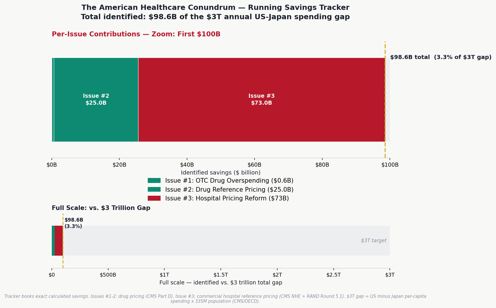
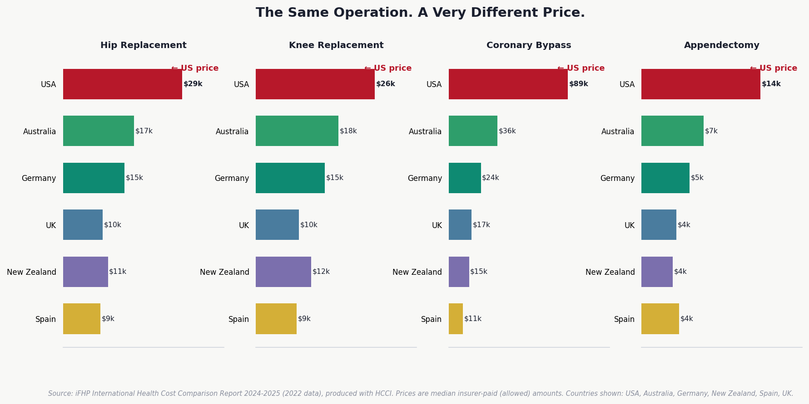
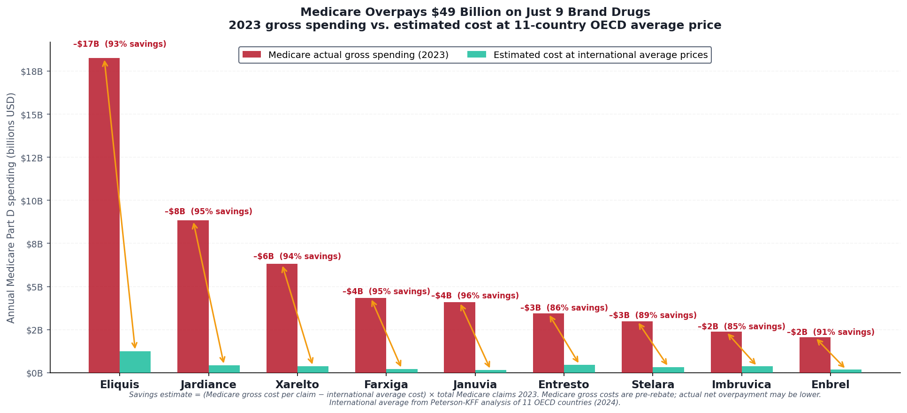

# The American Healthcare Conundrum

The US spends ~$14,570 per person on healthcare. Japan spends ~$5,790 and has the highest life expectancy in the OECD. That gap is roughly **$3 trillion per year.**

This project finds it, one issue at a time. Each issue identifies one fixable problem, quantifies the waste from primary federal data, and recommends a specific policy fix. All code is open-source. Anyone can reproduce the analysis.

**[Subscribe on Substack](https://andrewrexroad.substack.com)** | **[MIT License](LICENSE)** | **[Contributing](CONTRIBUTING.md)**

---

## Savings Identified So Far

| # | Issue | Savings | Key Finding | Data Source |
|---|-------|---------|-------------|-------------|
| 1 | [OTC Drug Overspending](issue_01/newsletter_issue_01_FINAL.md) | $0.6B/yr | Medicare pays Rx prices for drugs you can buy off the shelf | CMS Part D 2023 |
| 2 | [The Same Pill, A Different Price](issue_02/newsletter_issue_02_FINAL.md) | $25.0B/yr | US pays 7–581x more than peer nations for the same drugs | CMS Part D, NHS Tariff, RAND |
| 3 | [The 254% Problem](issue_03/newsletter_issue_03.md) | $73.0B/yr | Commercial insurers pay 254% of Medicare for identical hospital procedures | CMS HCRIS, RAND 5.1 |
| | **Running Total** | **$98.6B/yr** | **3.3% of the $3T gap** | |



---

## The Core Finding

The same operations. Exposed to the same clinical evidence. Wildly different prices.



*Source: iFHP International Health Cost Comparison 2024–2025. Prices are median insurer-paid amounts.*

---

## Published Issues

### Issue #3 — The 254% Problem (~$73.0B/year)

Commercial insurers pay 254% of Medicare rates for identical hospital procedures. A hip replacement costs $29,000 in the US and under $11,000 in most peer nations. Capping commercial hospital payments at 200% of Medicare — the mechanism already used by Montana Medicaid and thousands of self-insured employers — would save approximately **$73 billion per year**.

**Read the full analysis →** [`issue_03/newsletter_issue_03.md`](issue_03/newsletter_issue_03.md)

<details>
<summary>Running the pipeline</summary>

```bash
cd issue_03

# Build HCRIS cost report dataset and compute cost-to-charge ratios
python 01_build_data.py

# Generate charts
python 02_visualize.py
```

</details>

<details>
<summary>Data sources</summary>

| Source | Description |
|--------|-------------|
| CMS HCRIS HOSP10-REPORTS FY2023 | Cost reports for 3,193 hospitals; cost-to-charge ratios and operating costs |
| RAND Round 5.1 Hospital Pricing Study (2023) | Commercial insurer payments = 254% of Medicare for identical procedures |
| International Federation of Health Plans 2024-2025 | Procedure prices by country (hip replacement, bypass, etc.) |
| Peterson-KFF Health System Tracker | US vs. peer-nation procedure cost comparisons |
| CMS National Health Expenditure Accounts 2023 | Total US hospital spending $1.361T; private insurance share 38.8% |
| NASHP Montana Analysis (April 2021) | Independent evaluation of reference-based hospital pricing impact |

</details>

<details>
<summary>Key methodology notes</summary>

- Savings formula: $528B commercial hospital spend × 65% addressable × 21.3% price reduction (254%→200% of Medicare) = $73B
- 3,193 hospitals analyzed from raw HCRIS FY2023 federal cost reports
- For-profit hospitals: 4.11× median markup (highest); nonprofit: 2.46×; government: 2.22×. 37% of all hospitals charge 3× or more
- **Correction (2026-03-17):** Original release mislabeled CMS ownership codes, swapping nonprofit and for-profit categories. The $73B savings estimate was unaffected (derived from RAND/CMS NHE national data). See `issue_03/CTRL_TYPE_AUDIT.md` for details.
- Fix mechanism (Commercial Reference Pricing) is already implemented in Montana and by thousands of self-insured employers
- No overlap with Issues #1 or #2 (those cover drug prices only; this covers hospital/procedure prices)

</details>

---

### Issue #2 — The Same Pill, A Different Price (~$25.0B/year)

Medicare pays 7–25× more than peer nations for the same brand-name drugs. International reference pricing — benchmarking Medicare negotiations against what Germany, France, Japan, UK, and Australia pay — would save approximately **$25 billion per year**.



*Source: CMS Part D 2023 gross spend, Peterson-KFF 11-country OECD average prices. Savings = gross differential before rebate adjustment.*

**Read the full analysis →** [`issue_02/newsletter_issue_02_FINAL.md`](issue_02/newsletter_issue_02_FINAL.md)

<details>
<summary>Running the pipeline</summary>

```bash
cd issue_02

# Build reference price dataset (NHS Drug Tariff + RAND international averages)
python 01_build_reference_data.py

# Generate charts
python 02_visualize.py
```

</details>

<details>
<summary>Data sources</summary>

| Source | Description |
|--------|-------------|
| CMS Medicare Part D Spending by Drug (2023) | Gross drug spend and claim counts by drug name |
| NHS Drug Tariff Part VIIIA (March 2026) | UK generic reimbursement prices post-patent expiry |
| RAND RRA788-3 (Feb 2024) | International prescription drug price comparisons using 2022 data |
| Peterson-KFF Health System Tracker (Dec 2024) | 11-country OECD drug price benchmarks |

</details>

<details>
<summary>Key methodology notes</summary>

- Medicare figures are gross cost (pre-rebate) from CMS Part D Public Use File
- ~49% net rebate adjustment applied for top-spend brand drugs, triangulated from MedPAC and Feldman et al.
- NHS prices are post-patent generic reimbursement rates — representing the molecule's commodity price
- International average = Peterson-KFF 11-country OECD analysis

</details>

---

### Issue #1 — Medicare's OTC Drug Problem (~$0.6B/year)

Medicare Part D pays prescription prices for drugs available cheaply over-the-counter. Step therapy reform — requiring OTC equivalents before prescription coverage activates — would redirect roughly **$0.6 billion per year** in unnecessary spending.

**Read the full analysis →** [`issue_01/newsletter_issue_01_FINAL.md`](issue_01/newsletter_issue_01_FINAL.md)

<details>
<summary>Running the pipeline</summary>

```bash
cd issue_01

# One-time environment setup
chmod +x 01_setup.sh && ./01_setup.sh
source .venv/bin/activate

# Download CMS Part D data (~200 MB)
python 02_download_data.py

# Build local DuckDB database
python 03_build_database.py

# Run analysis
python 04_analyze.py

# Generate charts
python 05_visualize.py
```

</details>

<details>
<summary>Data sources</summary>

| Source | URL |
|--------|-----|
| CMS Part D Spending by Drug (2023) | https://data.cms.gov/summary-statistics-on-use-and-payments/medicare-medicaid-spending-by-drug/medicare-part-d-spending-by-drug |
| JAMA — OTC Equivalents Study (Socal 2023) | https://pmc.ncbi.nlm.nih.gov/articles/PMC10722384/ |
| MedPAC Part D Report (2024) | https://www.medpac.gov/wp-content/uploads/2024/03/Mar24_Ch11_MedPAC_Report_To_Congress_SEC.pdf |

</details>

<details>
<summary>Key methodology notes</summary>

- OTC unit prices sourced from current retail at major US pharmacies (March 2026)
- 30-unit-per-claim approximation; see `issue_01/VALIDATION_REPORT.md` for full methodology
- Savings figures are conservative — do not account for PBM rebates or dispensing fees

</details>

---

**Through 3 issues: ~$98.6 billion in identified savings**

---

## Up Next

Issue #4 examines pharmacy benefit managers — the largely invisible intermediaries who process 80% of US prescriptions and extract billions through spread pricing, rebate opacity, and formulary manipulation. Subscribe on Substack to get it when it drops.

---

## About This Project

Every analysis uses primary sources: CMS cost reports, Part D claims data, OECD health statistics, RAND pricing studies. Every number has a citation. Every script is reproducible from a clean clone. Caveats are named explicitly. The math is the argument.

Built by [Andrew Rexroad](https://andrewrexroad.substack.com). Questions, corrections, or data tips: vonrexroad@gmail.com
