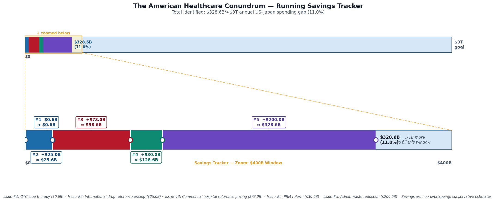
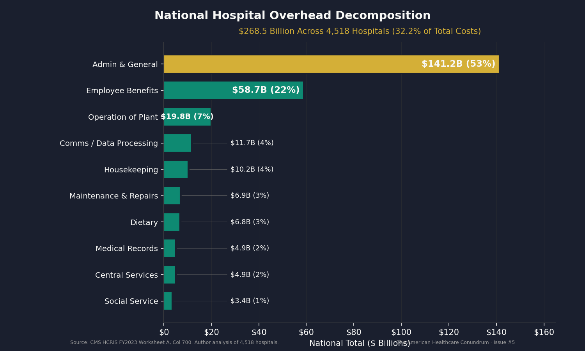
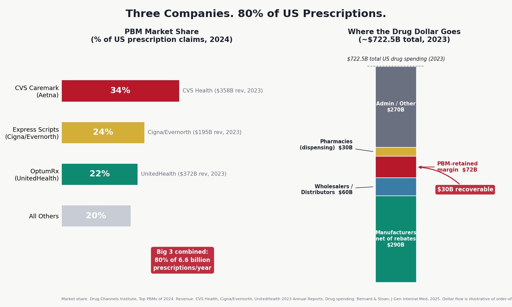

# The American Healthcare Conundrum

The US spends ~$14,570 per person on healthcare. Japan spends ~$5,790 and has the highest life expectancy in the OECD. That gap is roughly **$3 trillion per year.**

This project finds it, one issue at a time. Each issue identifies one fixable problem, quantifies the waste from primary federal data, and recommends a specific policy fix. All code is open-source. Anyone can reproduce the analysis.

**[Subscribe on Substack](https://andrewrexroad.substack.com)** | **[MIT License](LICENSE)** | **[Contributing](CONTRIBUTING.md)**

---

## Savings Identified So Far

| # | Issue | Savings | Key Finding | Data Source |
|---|-------|---------|-------------|-------------|
| 1 | [OTC Drug Overspending](issue_01/newsletter_issue_01_FINAL.md) | $0.6B/yr | Medicare pays Rx prices for drugs you can buy off the shelf | CMS Part D 2023 |
| 2 | [The Same Pill, A Different Price](issue_02/newsletter_issue_02_FINAL.md) | $25.0B/yr | US pays 7–581x more than peer nations for the same drugs | CMS Part D, NHS Tariff, RAND |
| 3 | [The 254% Problem](issue_03/newsletter_issue_03.md) | $73.0B/yr | Commercial insurers pay 254% of Medicare for identical hospital procedures | CMS HCRIS, RAND 5.1 |
| 4 | [The Middlemen](issue_04/newsletter_issue_04.md) | $30.0B/yr | Three PBMs process 80% of US prescriptions and extract ~$30B/yr through spread pricing, rebate opacity, and formulary manipulation | FTC Interim Reports, Ohio Auditor, JAMA |
| 5 | [The Paper Chase](issue_05/newsletter_issue_05.md) | $200.0B/yr | US spends $4,983/person on healthcare admin vs. $884 in peer nations; original HCRIS analysis of 4,518 hospitals reveals 6.2× variance in overhead costs | CMS HCRIS, CMS NHE, OECD, AMA |
| | **Running Total** | **$328.6B/yr** | **11.0% of the $3T gap** | |



---

## The Core Finding

The same operations. Exposed to the same clinical evidence. Wildly different prices.


*Source: iFHP International Health Cost Comparison 2024–2025. Prices are median insurer-paid amounts.*

---

## Published Issues

### Issue #5 — The Paper Chase: Administrative Waste (~$200.0B/year)

The US spends $4,983 per person just to administer healthcare — 5.6× the $884 average across ten peer nations. An original analysis of 4,518 hospital cost reports (CMS HCRIS FY2023) reveals a 6.2× variance in administrative overhead per discharge nationally. Even within same-size, same-acuity peer groups, the gap is 2.0–3.1×. Prior authorization alone costs the system $21–93 billion per year. Standardized billing, automated prior auth, and all-payer rate setting would save approximately **$200 billion per year**.



*Source: CMS HCRIS FY2023, 4,518 hospitals with ≥100 discharges.*

**Read the full analysis →** [`issue_05/newsletter_issue_05.md`](issue_05/newsletter_issue_05.md)

<details>
<summary>Running the pipeline</summary>

```bash
cd issue_05

# Generate all charts
python generate_all_charts.py
```

</details>

<details>
<summary>Data sources</summary>

| Source | Description |
|--------|-------------|
| CMS HCRIS HOSP10-REPORTS FY2023 | Cost reports for 4,518 hospitals; administrative overhead, A&G costs, total expenses |
| CMS National Health Expenditure Accounts 2023 | Total US healthcare spending $4.867T; admin share benchmarks |
| OECD Health Statistics 2023 | Per-capita admin spending across 10 peer nations |
| Woolhandler/Himmelstein 2020, Annals of Internal Medicine | US healthcare admin costs: $812B (2017), updated to $1.13–1.66T (2023) |
| AMA Prior Authorization Survey 2024 | 93% of physicians report PA delays care; 7% report PA contributed to patient death |
| Health Affairs Nov 2025 | Full-system PA cost: $93.3B/year (payers $6B, manufacturers $24.8B, physicians $26.7B, patients $35.8B) |
| Gaffney, Himmelstein, Woolhandler & Kahn 2023 | International admin cost comparison methodology |

</details>

<details>
<summary>Key methodology notes</summary>

- Four original analyses: (1) per-capita international comparison (US $4,983 vs 10-peer avg $884), (2) Woolhandler update to 2023 ($1.13–1.66T), (3) prior auth national cost ($21–93B), (4) HCRIS hospital admin variance
- HCRIS analysis: 4,518 hospitals (≥100 discharges, nonzero A&G), $141.2B total A&G, $268.5B total overhead (32.2% of total costs)
- P75/P25 ratio: 6.2× nationally, 2.0–2.7× within bed-size peers (CMI-adjusted: 2.1–3.1×)
- Ownership: For-profit median $458/DC, nonprofit $1,980/DC, government $2,524/DC
- Savings: Q4→P75 = $18.0B, above-median→P50 = $39.8B (hospital admin only; $200B includes full system)
- Published dataset: `hospital_admin_costs_fy2023.csv` (4,518 hospitals, 22 columns)
- No overlap with Issues #1–4: those cover drug prices, hospital procedure prices, and PBM extraction; this covers administrative overhead

</details>

---


### Issue #4 — The Middlemen: Pharmacy Benefit Managers (~$30.0B/year)

Three companies — CVS Caremark, Express Scripts, and OptumRx — process 80% of the 6.6 billion prescriptions Americans fill each year. The Federal Trade Commission spent two years investigating their practices and documented billions in extraction through six distinct mechanisms: spread pricing, rebate opacity, specialty drug markup, formulary manipulation, self-preferencing, and independent pharmacy destruction. The Ohio state auditor found $224.8 million in spread pricing from a single state's Medicaid program in a single year. Eliminating these extraction mechanisms — through rebate pass-through mandates, fiduciary standards, and formulary transparency — would save approximately **$30 billion per year**.



*Source: Drug Channels Institute 2024; Bernard & Sloan 2025.*

**Read the full analysis →** [`issue_04/newsletter_issue_04.md`](issue_04/newsletter_issue_04.md)

<details>
<summary>Running the pipeline</summary>

```bash
cd issue_04

# Generate charts
python chart1_pbm_market.py
python chart2_harm_spread.py
python chart4_biosimilar_v4.py
python chart5_insulin_prices.py
python generate_tracker_04.py
```

</details>

<details>
<summary>Data sources</summary>

| Source | Description |
|--------|-------------|
| FTC Interim Report #1 (July 2024) | $7.3B in PBM-owned specialty pharmacy markups, 2017–2022; $334B annual rebate flow |
| FTC Interim Report #2 (January 2025) | Vertical integration details and self-preferencing evidence |
| Ohio State Auditor (2018) | $224.8M spread pricing extracted from Ohio Medicaid in one year |
| Mattingly, Hyman & Bai 2023, JAMA Health Forum | Comprehensive review of PBM economics and agency conflicts |
| Drug Channels Institute 2024 | PBM market share: CVS 34%, ESI 24%, OptumRx 22% |
| Bernard & Sloan 2025, J Gen Internal Med | Total US prescription drug spending $722.5B (2023) |
| Kwon, Sarpatwari & Dusetzina 2025, JAMA Health Forum | Biosimilar adoption rates by state PBM law stringency |
| Chea, Sydor & Popovian 2023 | 57.4% of ESI formulary exclusions with questionable patient benefit |
| Knox, Gagneja & Kraschel 2021, JAMA Health Forum | 16.1% of rural independent pharmacies closed 2003–2018 |
| IQVIA National Prescription Audit | Manufacturer rebates: $334B annually paid to PBMs/plans |

</details>

<details>
<summary>Key methodology notes</summary>

- Savings model is conservative, built from six distinct non-overlapping mechanisms
- Mechanism 1 (spread pricing): $3.0B — Ohio audit extrapolated to national Medicaid managed care
- Mechanism 2 (rebate pass-through): $10.0B — PBMs retain estimated 5–10% above disclosed admin fees on $334B rebate pool
- Mechanism 3 (specialty markup): $1.5B — FTC-documented $7.3B over 5 years, annualized
- Mechanism 4 (formulary reform/biosimilar preference): $10.0B — biosimilar adoption gap vs. states with strong PBM laws
- Mechanism 5 (admin transparency savings): $5.5B — waste from opaque PBM reporting requirements
- Total booked: $30.0B/year (range $30–50B)
- No overlap with Issues #1–3: Issue #2 addresses manufacturer-level drug prices; Issue #4 addresses the intermediary extraction layer on top of those prices
- CAA 2026 (enacted Feb 3, 2026) includes rebate pass-through effective 2029 for commercial plans; FTC settled with Express Scripts Feb 4, 2026 ($700M/yr projected savings from one PBM)

</details>

---


### Issue #3 — The 254% Problem (~$73.0B/year)

Commercial insurers pay 254% of Medicare rates for identical hospital procedures. A hip replacement costs $29,000 in the US and under $11,000 in most peer nations. Capping commercial hospital payments at 200% of Medicare — the mechanism already used by Montana Medicaid and thousands of self-insured employers — would save approximately **$73 billion per year**.

**Read the full analysis →** [`issue_03/newsletter_issue_03.md`](issue_03/newsletter_issue_03.md)

<details>
<summary>Running the pipeline</summary>

```bash
cd issue_03

# Build HCRIS cost report dataset and compute cost-to-charge ratios
python 01_build_data.py

# Generate charts
python 02_visualize.py
```

</details>

<details>
<summary>Data sources</summary>

| Source | Description |
|--------|-------------|
| CMS HCRIS HOSP10-REPORTS FY2023 | Cost reports for 3,193 hospitals; cost-to-charge ratios and operating costs |
| RAND Round 5.1 Hospital Pricing Study (2023) | Commercial insurer payments = 254% of Medicare for identical procedures |
| International Federation of Health Plans 2024-2025 | Procedure prices by country (hip replacement, bypass, etc.) |
| Peterson-KFF Health System Tracker | US vs. peer-nation procedure cost comparisons |
| CMS National Health Expenditure Accounts 2023 | Total US hospital spending $1.361T; private insurance share 38.8% |
| NASHP Montana Analysis (April 2021) | Independent evaluation of reference-based hospital pricing impact |

</details>

<details>
<summary>Key methodology notes</summary>

- Savings formula: $528B commercial hospital spend × 65% addressable × 21.3% price reduction (254%→200% of Medicare) = $73B
- 3,193 hospitals analyzed from raw HCRIS FY2023 federal cost reports
- For-profit hospitals: 4.11× median markup (highest); nonprofit: 2.46×; government: 2.22×. 37% of all hospitals charge 3× or more
- **Correction (2026-03-17):** Original release mislabeled CMS ownership codes, swapping nonprofit and for-profit categories. The $73B savings estimate was unaffected (derived from RAND/CMS NHE national data). See `issue_03/CTRL_TYPE_AUDIT.md` for details.
- Fix mechanism (Commercial Reference Pricing) is already implemented in Montana and by thousands of self-insured employers
- No overlap with Issues #1 or #2 (those cover drug prices only; this covers hospital/procedure prices)

</details>

---

### Issue #2 — The Same Pill, A Different Price (~$25.0B/year)

Medicare pays 7–25× more than peer nations for the same brand-name drugs. International reference pricing — benchmarking Medicare negotiations against what Germany, France, Japan, UK, and Australia pay — would save approximately **$25 billion per year**.


*Source: CMS Part D 2023 gross spend, Peterson-KFF 11-country OECD average prices. Savings = gross differential before rebate adjustment.*

**Read the full analysis →** [`issue_02/newsletter_issue_02_FINAL.md`](issue_02/newsletter_issue_02_FINAL.md)

<details>
<summary>Running the pipeline</summary>

```bash
cd issue_02

# Build reference price dataset (NHS Drug Tariff + RAND international averages)
python 01_build_reference_data.py

# Generate charts
python 02_visualize.py
```

</details>

<details>
<summary>Data sources</summary>

| Source | Description |
|--------|-------------|
| CMS Medicare Part D Spending by Drug (2023) | Gross drug spend and claim counts by drug name |
| NHS Drug Tariff Part VIIIA (March 2026) | UK generic reimbursement prices post-patent expiry |
| RAND RRA788-3 (Feb 2024) | International prescription drug price comparisons using 2022 data |
| Peterson-KFF Health System Tracker (Dec 2024) | 11-country OECD drug price benchmarks |

</details>

<details>
<summary>Key methodology notes</summary>

- Medicare figures are gross cost (pre-rebate) from CMS Part D Public Use File
- ~49% net rebate adjustment applied for top-spend brand drugs, triangulated from MedPAC and Feldman et al.
- NHS prices are post-patent generic reimbursement rates — representing the molecule's commodity price
- International average = Peterson-KFF 11-country OECD analysis

</details>

---

### Issue #1 — Medicare's OTC Drug Problem (~$0.6B/year)

Medicare Part D pays prescription prices for drugs available cheaply over-the-counter. Step therapy reform — requiring OTC equivalents before prescription coverage activates — would redirect roughly **$0.6 billion per year** in unnecessary spending.

**Read the full analysis →** [`issue_01/newsletter_issue_01_FINAL.md`](issue_01/newsletter_issue_01_FINAL.md)

<details>
<summary>Running the pipeline</summary>

```bash
cd issue_01

# One-time environment setup
chmod +x 01_setup.sh && ./01_setup.sh
source .venv/bin/activate

# Download CMS Part D data (~200 MB)
python 02_download_data.py

# Build local DuckDB database
python 03_build_database.py

# Run analysis
python 04_analyze.py

# Generate charts
python 05_visualize.py
```

</details>

<details>
<summary>Data sources</summary>

| Source | URL |
|--------|-----|
| CMS Part D Spending by Drug (2023) | https://data.cms.gov/summary-statistics-on-use-and-payments/medicare-medicaid-spending-by-drug/medicare-part-d-spending-by-drug |
| JAMA — OTC Equivalents Study (Socal 2023) | https://pmc.ncbi.nlm.nih.gov/articles/PMC10722384/ |
| MedPAC Part D Report (2024) | https://www.medpac.gov/wp-content/uploads/2024/03/Mar24_Ch11_MedPAC_Report_To_Congress_SEC.pdf |

</details>

<details>
<summary>Key methodology notes</summary>

- OTC unit prices sourced from current retail at major US pharmacies (March 2026)
- 30-unit-per-claim approximation; see `issue_01/VALIDATION_REPORT.md` for full methodology
- Savings figures are conservative — do not account for PBM rebates or dispensing fees

</details>

---

**Through 5 issues: ~$328.6 billion in identified savings (11.0% of the $3T gap)**

---

## Up Next

Issue #6 examines hospital supply waste — an original HCRIS analysis of 5,480 hospitals reveals massive unexplained variance in per-discharge supply costs, with CMI-adjusted P75/P25 ratios of 2.5–3.4× within same-size peer groups. Subscribe on Substack to get it when it drops.

---

## About This Project

Every analysis uses primary sources: CMS cost reports, Part D claims data, OECD health statistics, RAND pricing studies. Every number has a citation. Every script is reproducible from a clean clone. Caveats are named explicitly. The math is the argument.

Built by [Andrew Rexroad](https://andrewrexroad.substack.com). Questions, corrections, or data tips: vonrexroad@gmail.com
